# Module 3: Data Lake Use Cases for BFSI

Original: https://sml-slides.aws.yikyakyuk.com/slides/deck.html?m=3

## Slide 1

Module 3 · BFSI Use Cases

Data lake use cases for banking & finance

Fraud detection, regulatory compliance, and Customer 360 on the governed lakehouse.

### Slide notes

Now we turn the platform into business value with the three universal BFSI use cases.

[Narration MP3](../source/decks/audio/m3/slide-1.mp3)

## Slide 2

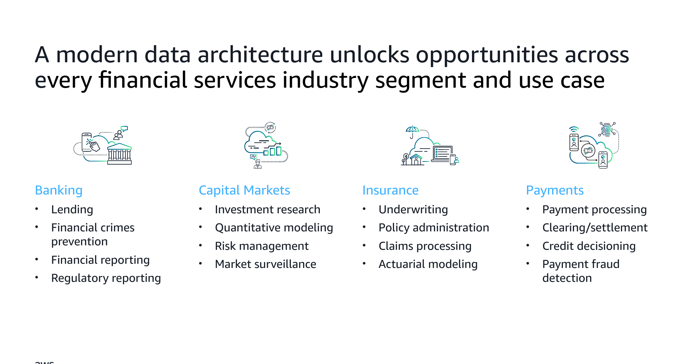

### Slide notes

The business value: a modern data architecture unlocks opportunities across every financial-services segment. In Banking, that includes lending, financial-crimes prevention, and financial and regulatory reporting. In Capital Markets, it includes investment research, quantitative modeling, risk management, and market surveillance. In Insurance, it includes underwriting, policy administration, claims processing, and actuarial modeling. In Payments, it includes payment processing, clearing and settlement, credit decisioning, and payment fraud detection. The central point is that one common data foundation serves many high-value use cases.

[Narration MP3](../source/decks/audio/m3/slide-2.mp3)

## Slide 3

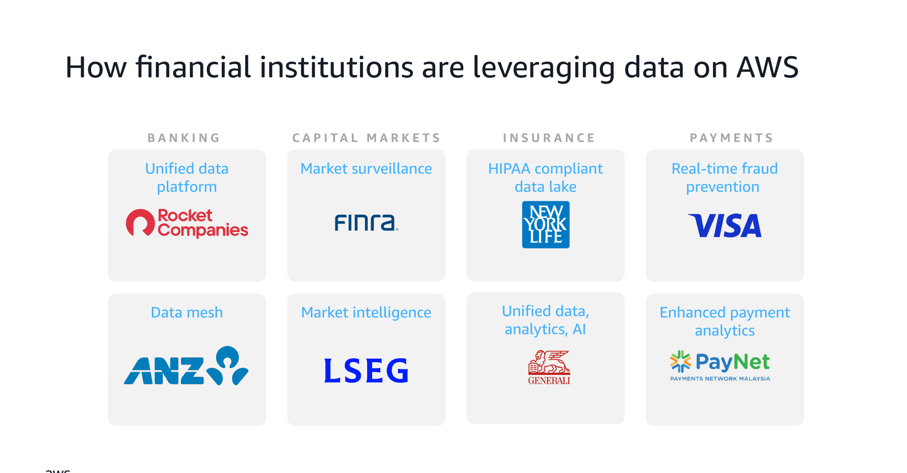

### Slide notes

How financial institutions are already leveraging data on AWS, mapped to segments. Banking examples include a unified data platform and real-time fraud prevention. Capital Markets examples include market surveillance, data mesh, and market intelligence. Insurance examples include a HIPAA-compliant data lake and unified data, analytics, and AI. Payments examples include enhanced payment analytics. These are real customer patterns, and they anchor the architectures explored in the rest of the deck.

[Narration MP3](../source/decks/audio/m3/slide-3.mp3)

## Slide 4

Use Case 1

Real-time fraud detection

Streaming transactions + customer risk context + ML scoring.

### Slide notes

Fraud costs banks billions; speed of detection is critical. We combine streaming with ML scoring.

[Narration MP3](../source/decks/audio/m3/slide-4.mp3)

## Slide 5

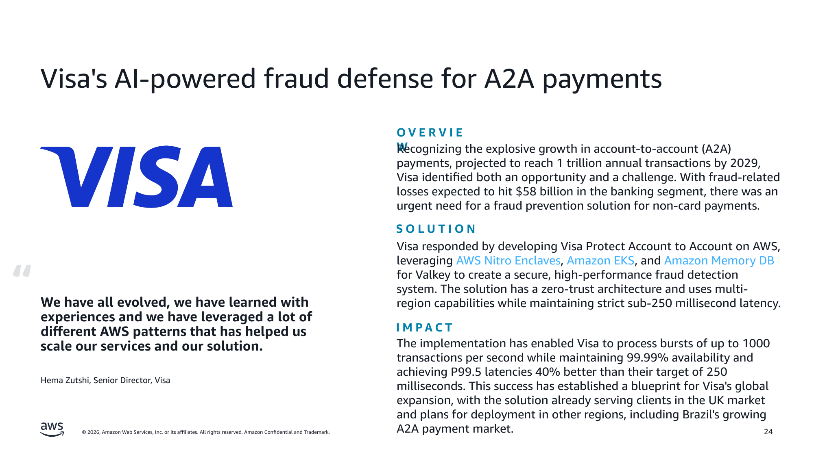

### Slide notes

Visa's AI-powered fraud defense for account-to-account (A2A) payments is a real-time fraud-detection solution built on AWS.

A2A payments are direct bank-to-bank transfers, either push (sender-initiated) or pull (recipient-initiated). The market is growing rapidly — projected 83% growth by 2029 toward roughly one trillion annual transactions — and fraud losses are projected to reach tens of billions of dollars, which is the problem Visa Protect Account to Account addresses. The solution had demanding requirements: stringent cybersecurity, data localization and GDPR compliance, sub-250-millisecond latency, and 99.99% uptime.

The architecture uses a DMZ VPC, AWS Nitro Enclaves for secure processing, a real-time scoring API, and a multi-region active-active design. Visa achieved sub-250-millisecond latency with P99.5 latencies about 40% better than target, and tested bursts up to 1,000 transactions per second. It is Visa's first major application on hybrid cloud, is live in the UK, and serves as a blueprint for expansion to other regions such as Brazil.

[Narration MP3](../source/decks/audio/m3/slide-5.mp3)

## Slide 6

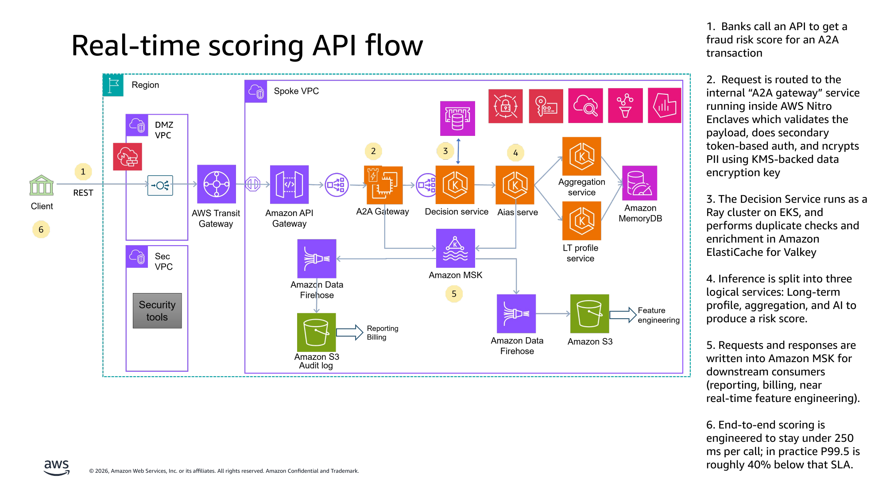

### Slide notes

The real-time fraud-scoring API flow for payments. A bank calls an API for a fraud risk score on an A2A transaction. The request is routed to an internal A2A gateway running in AWS Nitro Enclaves, which validates the payload, performs token-based authentication, and encrypts PII with a KMS-backed key. A Decision Service running as a Ray cluster on Amazon EKS performs duplicate checks and enrichment via Amazon ElastiCache for Valkey. Inference is split into long-term profile, aggregation, and AI services to produce the score. Requests and responses are written to Amazon MSK for downstream consumers. End-to-end scoring targets under 250 milliseconds per call, with P99.5 roughly 40% below that SLA.

[Narration MP3](../source/decks/audio/m3/slide-6.mp3)

## Slide 7

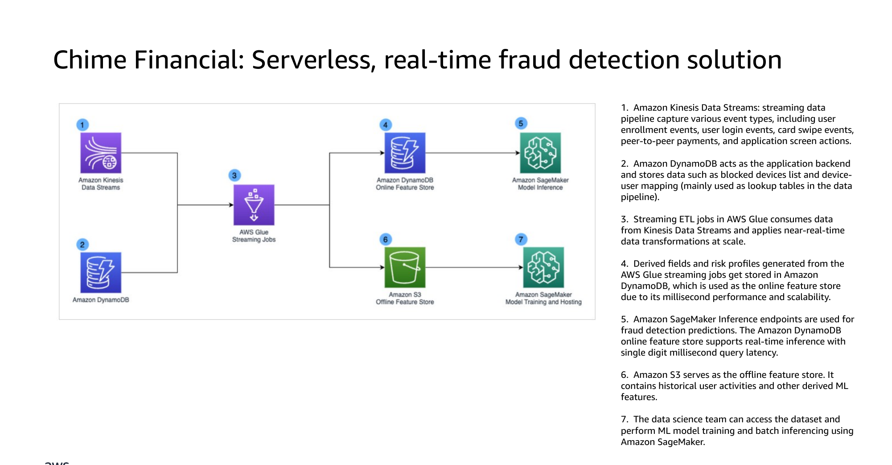

### Slide notes

A streaming data pipeline built on Amazon Kinesis Data Streams, based on how Chime Financial built a serverless stream-analytics platform to defeat fraudsters. The pipeline captures a variety of event types in real time — user enrollment events, user login events, card-swipe events, peer-to-peer payments, and application screen actions — and feeds them into serverless analytics so that fraud can be detected as events occur rather than after the fact.

[Narration MP3](../source/decks/audio/m3/slide-7.mp3)

## Slide 8

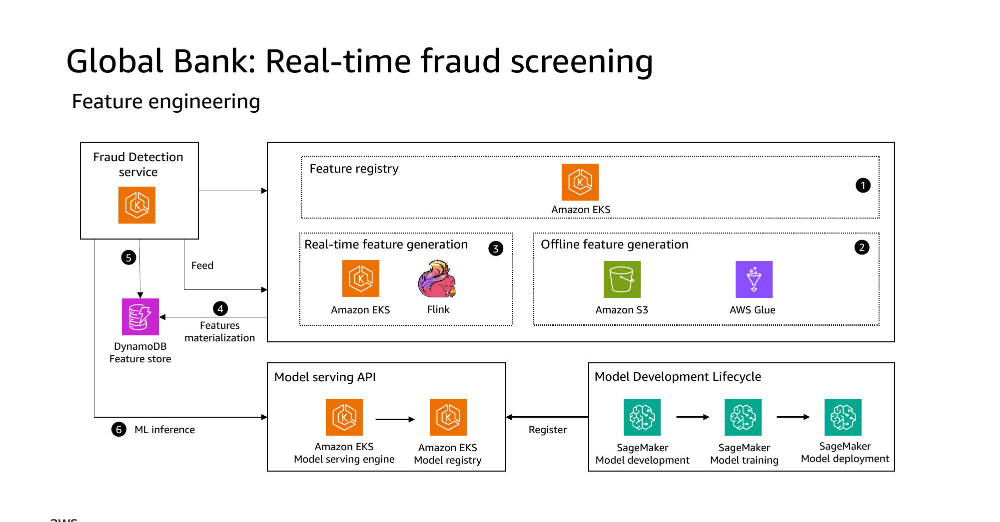

### Slide notes

A global bank's real-time fraud-screening use case. It shows how streaming ingestion, low-latency lookups, and real-time scoring combine so that transactions can be screened for fraud within the tight latency budget of a live payment, applying the same real-time patterns seen earlier in the Visa and Chime examples to a global-bank context.

[Narration MP3](../source/decks/audio/m3/slide-8.mp3)

## Slide 9

Use Case 2

Regulatory compliance & lineage

Auditable reports (CTR/SAR), data lineage, and row-level security.

### Slide notes

Regulators want to know where data came from. Lake Formation FGAC plus Iceberg time-travel give auditable compliance.

[Narration MP3](../source/decks/audio/m3/slide-9.mp3)

## Slide 10

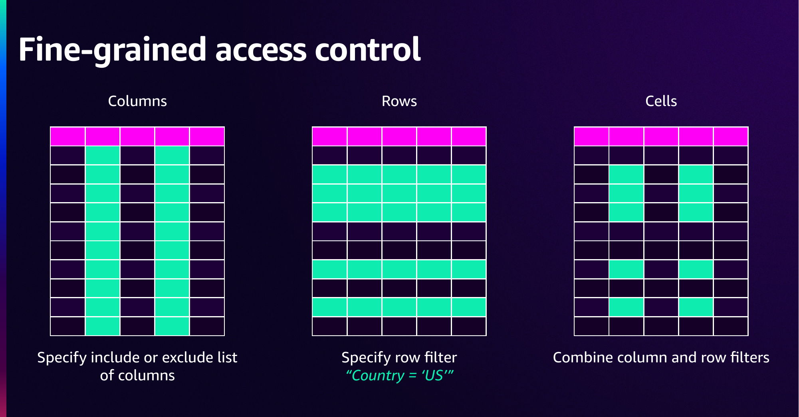

### Slide notes

Fine-grained access control mechanics. Restrict at the column level with include/exclude lists, at the row level with row filters (for example, Country = 'US'), or at the cell level by combining column and row filters, giving precise control over exactly which data a principal can see.

[Narration MP3](../source/decks/audio/m3/slide-10.mp3)

## Slide 11

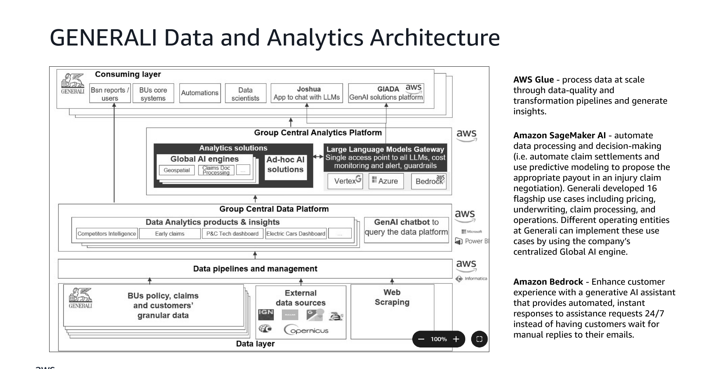

### Slide notes

Generali's data and analytics architecture in the insurance context. AWS Glue processes data at scale through data-quality and transformation pipelines. Amazon SageMaker AI automates data processing and decision-making — for example, automating claim settlements and using predictive modeling to propose payouts — and the 16 flagship use cases (pricing, underwriting, claims, operations) are run by operating entities via a centralized Global AI engine. Amazon Bedrock powers a generative-AI assistant that gives customers automated, instant, 24/7 responses instead of waiting for manual email replies.

[Narration MP3](../source/decks/audio/m3/slide-11.mp3)

## Slide 12

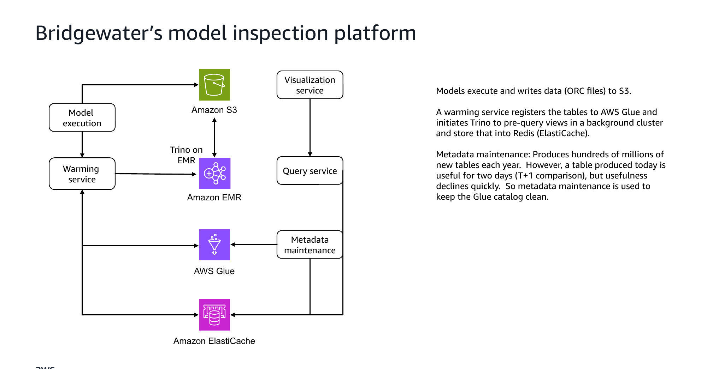

### Slide notes

Bridgewater's model-inspection platform for capital-markets research. Models execute and write ORC files to Amazon S3. A warming service registers tables in AWS Glue and triggers Trino on Amazon EMR to pre-query views in a background cluster, caching results in Amazon ElastiCache (Redis). Because the platform produces hundreds of millions of new tables per year, and a table is typically only useful for about two days (for T+1 comparison), a metadata-maintenance process continuously prunes the Glue catalog to keep it clean and performant.

[Narration MP3](../source/decks/audio/m3/slide-12.mp3)

## Slide 13

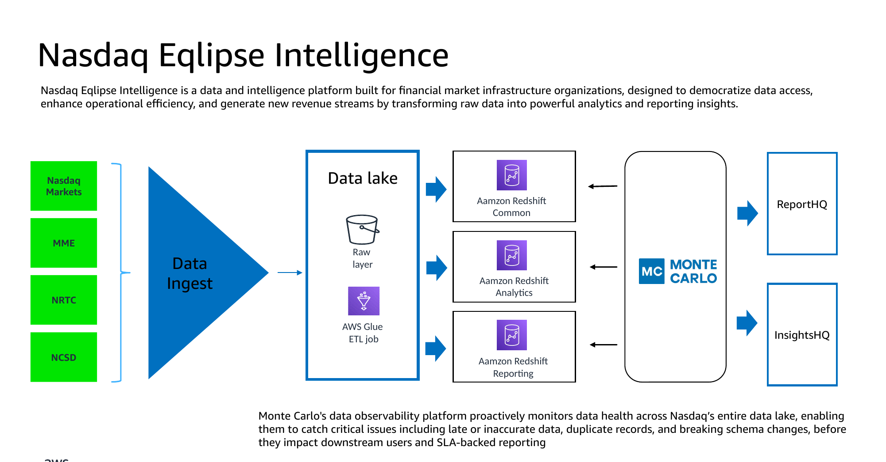

### Slide notes

The Nasdaq markets architecture with data observability built in. Data from sources such as NCSD, MME, and NRTC is ingested into a data-lake raw layer, transformed by AWS Glue ETL jobs, and loaded into Amazon Redshift (Common, Analytics, and Reporting layers), which feed ReportHQ and InsightsHQ. Nasdaq Eqlipse Intelligence is a data and intelligence platform for financial-market-infrastructure organizations that democratizes data access and turns raw data into analytics and reporting. Monte Carlo's data-observability platform monitors data health across the entire lake, catching late or inaccurate data, duplicates, and breaking schema changes before they affect downstream users and SLA-backed reporting.

[Narration MP3](../source/decks/audio/m3/slide-13.mp3)

## Slide 14

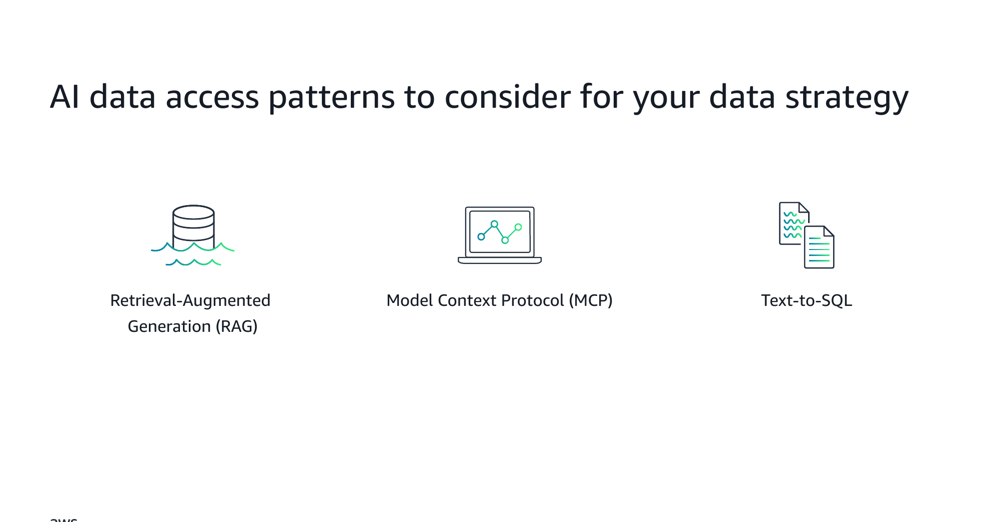

### Slide notes

An overview of three AI data access patterns to consider in a data strategy: Retrieval-Augmented Generation (RAG), the Model Context Protocol (MCP), and Text-to-SQL. Each connects large language models to enterprise data in a different way, and the following slides illustrate each with a financial-services example.

[Narration MP3](../source/decks/audio/m3/slide-14.mp3)

## Slide 15

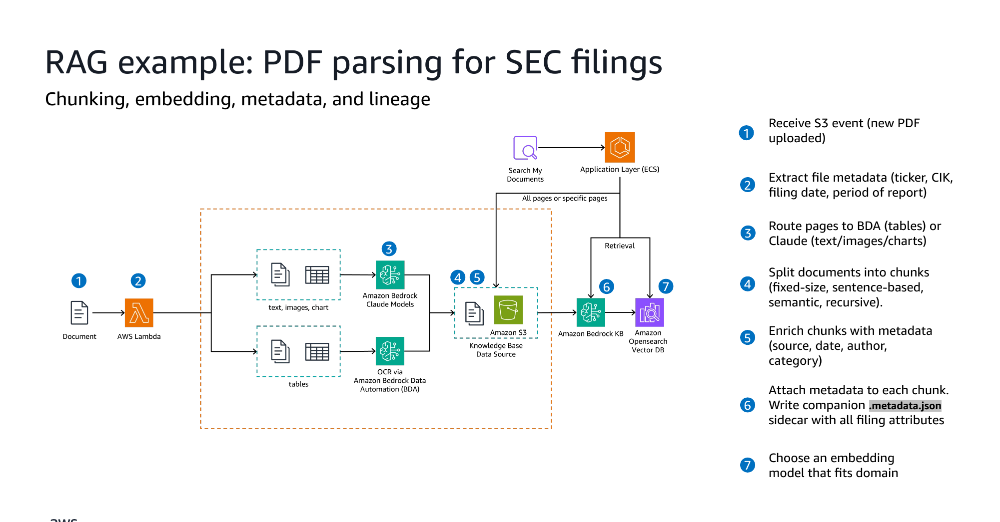

### Slide notes

A RAG example: a pipeline that parses PDF SEC filings. When a new PDF is uploaded, an S3 event triggers the pipeline, which extracts file metadata (ticker, CIK, filing date, reporting period) and routes pages to Amazon Bedrock Data Automation for tables or to Claude for text, images, and charts. Documents are split into chunks — fixed-size, sentence-based, semantic, or recursive — and each chunk is enriched with metadata (source, date, author, category) and a companion `.metadata.json` sidecar, with an embedding model chosen to suit the domain. The slide highlights chunking, embedding, metadata, and lineage as the core concerns of a production RAG pipeline.

[Narration MP3](../source/decks/audio/m3/slide-15.mp3)

## Slide 16

Use Case 3

Customer 360 & self-service BI

Unify core banking + digital behavior + risk into one view, visualized in QuickSight.

### Slide notes

Customer 360 is where the lakehouse shines: unified query across S3, Redshift, and Zero-ETL DynamoDB data.

[Narration MP3](../source/decks/audio/m3/slide-16.mp3)

## Slide 17

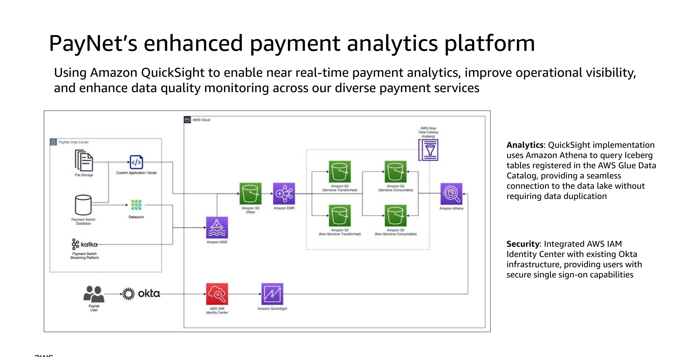

### Slide notes

The analytics layer of PayNet's payment-analytics solution. Amazon QuickSight queries Apache Iceberg tables through Amazon Athena, with the tables registered in the AWS Glue Data Catalog. This gives QuickSight a seamless connection to the data lake without duplicating data — the same single copy in the lake is queried in place — illustrating how a BI tool can sit directly on an open-table-format data lake.

[Narration MP3](../source/decks/audio/m3/slide-17.mp3)

## Slide 18

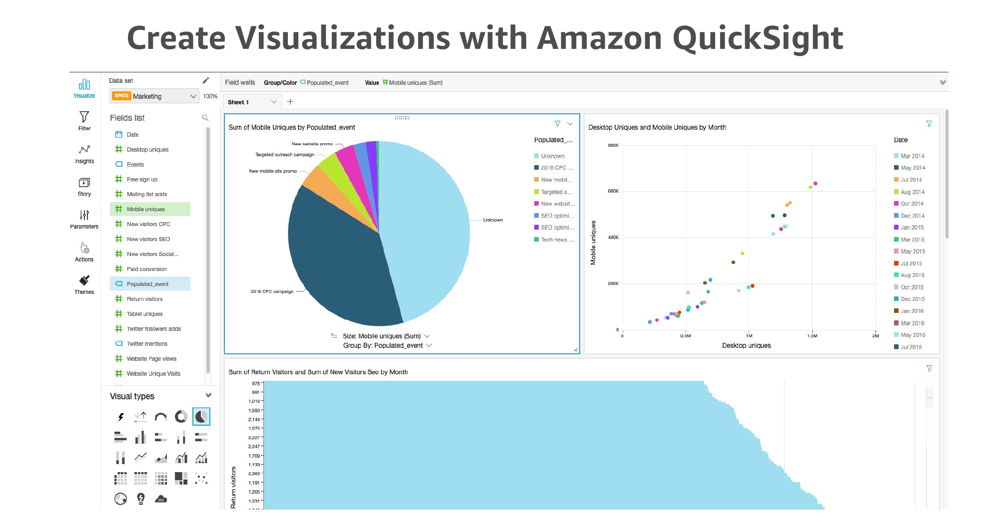

### Slide notes

This consumption pattern shifts perspective from engineers to business users. The engines covered so far — Athena and EMR — are used by analysts and engineers. Visualization with Amazon QuickSight is where the data lake reaches people who do not write SQL or Spark.

Amazon QuickSight is AWS's serverless business intelligence service for building interactive dashboards and visualizations. Like the other services in this session it is serverless, so there is no BI server to stand up, patch, or scale; it grows with your audience automatically.

QuickSight connects to the data-lake query engines already discussed, such as Athena, as well as to Amazon Redshift and many other sources. The same data landing in S3 can therefore be surfaced as charts, KPIs, and dashboards that a business audience can explore on their own.

This matters for adoption. The value of a data lake is only realized when people act on it, and most decision-makers consume insight through dashboards rather than query consoles. QuickSight is how the raw data and analytics flow all the way through to the people making decisions, without those people needing to manage infrastructure or understand the underlying storage.

[Narration MP3](../source/decks/audio/m3/slide-18.mp3)

## Slide 19

Module 3 · Summary

BFSI use cases — recap

- Fraud: streaming + ML scoring on enriched features

- Compliance: fine-grained access, lineage, and time-travel for auditability

- Customer 360: one unified view across lake, warehouse, and operational data

- All three run on the single platform built in Modules 1–2 — no silos

### Slide notes

Recap. Module 4 pulls back to architecture patterns and next steps.

[Narration MP3](../source/decks/audio/m3/slide-19.mp3)
