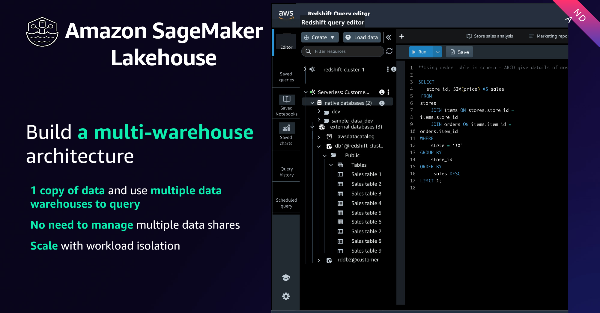
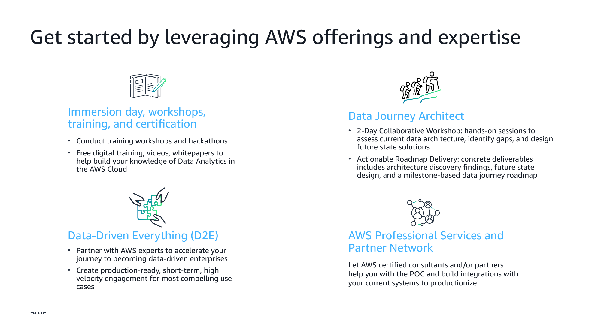
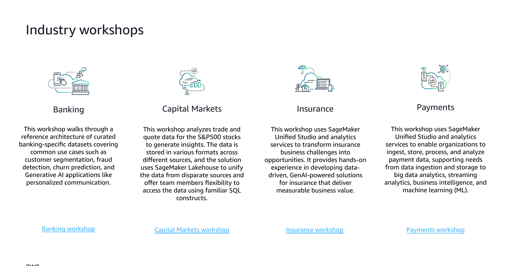

# Module 4: Wrap-Up, Patterns & Next Steps

Original: https://sml-slides.aws.yikyakyuk.com/slides/deck.html?m=4

## Slide 1

Module 4 · Wrap-Up

Patterns & next steps

### Slide notes

A short wrap-up: how to choose a pattern, what's next with agentic AI, and where to go from here.

[Narration MP3](../source/decks/audio/m4/slide-1.mp3)

## Slide 2

Decision framework

Choosing an architecture patternRequirementPatternKey servicesSingle team, structured dataLakehouseS3 + Iceberg + Redshift + AthenaMany domains, decentralized ownershipData MeshSageMaker Catalog + multi-account + Lake FormationEvent-driven, low latencyStreamingMSK + Flink + Firehose + Redshift streamingMinimal ops, variable loadServerless analyticsAthena + Glue + S3 + QuickSightRegulated (BFSI)Governed lakehouse + meshLake Formation + SageMaker Catalog + CloudTrail

### Slide notes

Match the pattern to the requirement. BFSI typically lands on a governed lakehouse, often with a mesh across domains.

[Narration MP3](../source/decks/audio/m4/slide-2.mp3)

## Slide 3

### Slide notes

Multi-warehouse architecture pattern. Keep one copy of data and use multiple data warehouses to query it, with no need to manage multiple datashares, scaling with workload isolation. This shows the lakehouse enabling separate compute for different teams over shared data.

[Narration MP3](../source/decks/audio/m4/slide-3.mp3)

## Slide 4

Emerging · 2026

Data Mesh + Agentic AI

- Domain teams publish governed data products via SageMaker Catalog

- AI agents (Amazon Bedrock) autonomously discover and access those products

- Governance guardrails enforce access controls on agent queries

- BFSI: AI advisors, automated compliance agents, Customer-360-aware service

### Slide notes

The next step: the same governed data products that serve analysts also safely serve autonomous AI agents.

[Narration MP3](../source/decks/audio/m4/slide-4.mp3)

## Slide 5

### Slide notes

How to get started using AWS offerings and expertise. Options include immersion days, workshops, training, and certification (including free digital training, videos, and whitepapers); the Data-Driven Everything (D2E) program, which pairs you with AWS experts on high-velocity engagements for compelling use cases; AWS Professional Services and the AWS Partner Network to help build proofs of concept and productionize integrations; and the Data Journey Architect, a two-day collaborative workshop that assesses the current architecture, identifies gaps, and delivers a milestone-based data-journey roadmap.

[Narration MP3](../source/decks/audio/m4/slide-5.mp3)

## Slide 6

### Slide notes

Industry workshops available by segment. For Banking, a reference architecture of curated banking datasets covers customer segmentation, fraud detection, churn prediction, and generative-AI personalization. For Capital Markets, a workshop analyzes S&P 500 trade-and-quote data using SageMaker Lakehouse to unify data from disparate sources and query it with familiar SQL. For Insurance, a workshop uses SageMaker Unified Studio and analytics services to build data-driven, generative-AI insurance solutions. For Payments, a workshop uses SageMaker Unified Studio to ingest, store, process, and analyze payment data across big-data, streaming, BI, and ML needs.

[Narration MP3](../source/decks/audio/m4/slide-6.mp3)

## Slide 7

Thank you

Build your modern data platform

Start with a lakehouse foundation, add Zero-ETL and governance, then layer on BFSI use cases.

Hands-on next step: Amazon SageMaker Workshop for Retail Banking — catalog.us-east-1.prod.workshops.aws

### Slide notes

Thank you. Recommended next step: the retail banking workshop covering Unified Studio, Lakehouse, Catalog, fraud detection, and GenAI.

[Narration MP3](../source/decks/audio/m4/slide-7.mp3)
