# Module 5: Redshift & RMS Deep Dive

Original: https://sml-slides.aws.yikyakyuk.com/slides/deck.html?m=5

## Slide 1

Module 5 · Deep Dive

Amazon Redshift & RMS in the Lakehouse

Redshift Managed Storage, bring-your-own-Redshift federated catalogs, and querying Redshift data from any engine.

### Slide notes

An appendix deep dive into how Amazon Redshift and Redshift Managed Storage (RMS) work inside the SageMaker Lakehouse: storage, catalogs, registration, and multi-engine access.

[Narration MP3](../source/decks/audio/m5/slide-1.mp3)

## Slide 2

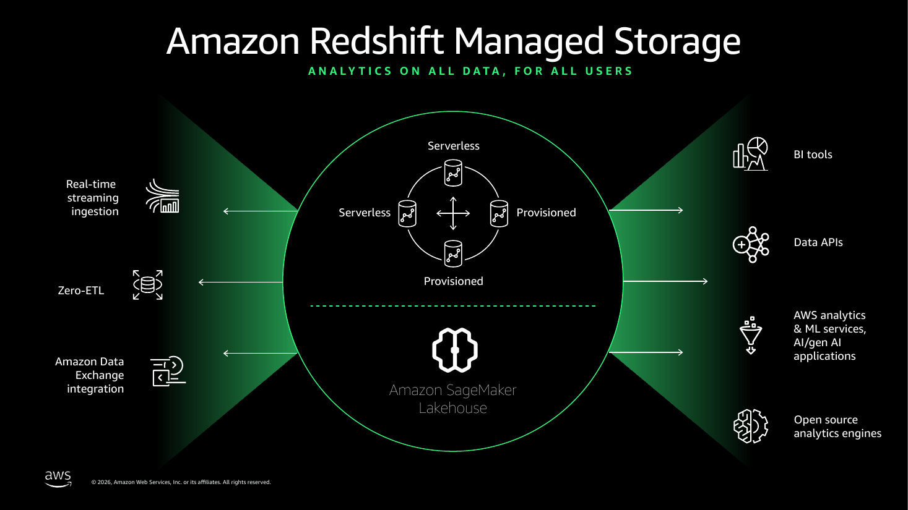

### Slide notes

Continues RMS: you can publish data from existing Amazon Redshift data warehouses to the lakehouse, create new data-lake datasets directly in RMS from within the lakehouse, and benefit from ML-powered optimizations for frequently running workloads.

[Narration MP3](../source/decks/audio/m5/slide-2.mp3)

## Slide 3

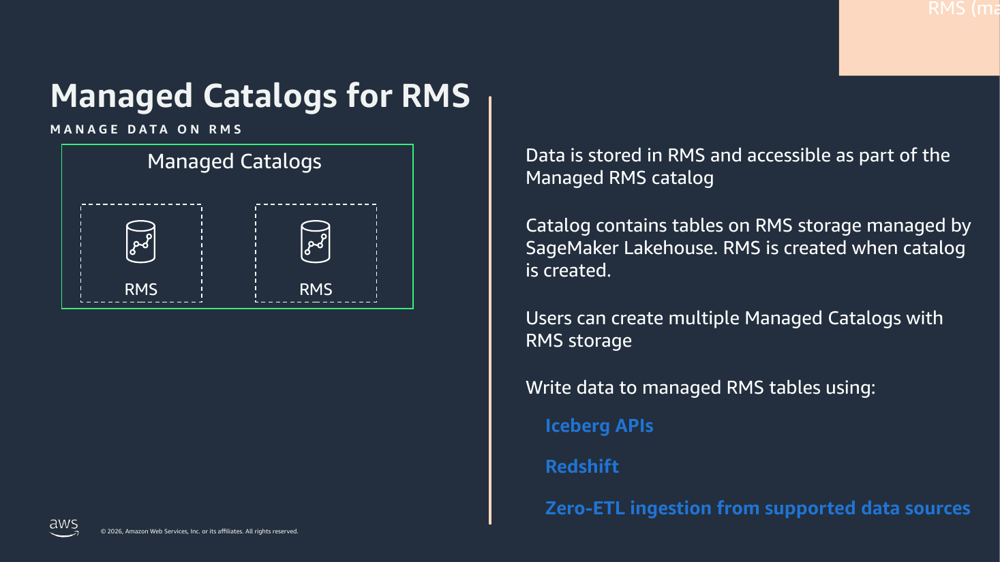

### Slide notes

Managed Catalogs for RMS. Data is stored in RMS and accessed as part of the managed RMS catalog; RMS is provisioned when the catalog is created. You can create multiple managed RMS catalogs and write to managed RMS tables via Iceberg APIs, via Redshift, or via zero-ETL ingestion from supported sources. Consumers include Iceberg engines, AWS services, and Redshift, with Lake Formation governing the catalog.

[Narration MP3](../source/decks/audio/m5/slide-3.mp3)

## Slide 4

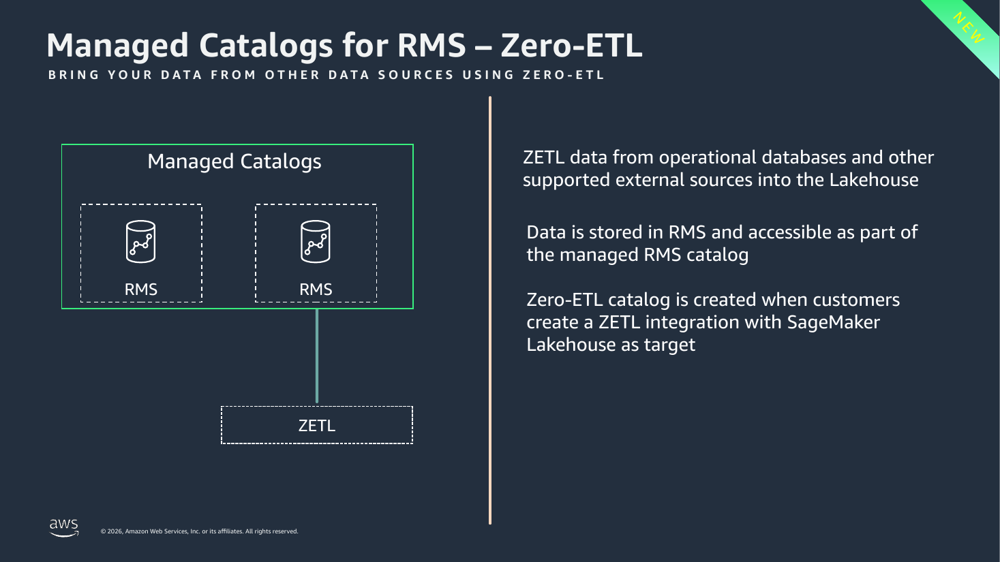

### Slide notes

Managed Catalogs for RMS via zero-ETL. You can zero-ETL data from operational databases and other supported external sources into the lakehouse; the data lands in RMS and is accessed through the managed RMS catalog. A zero-ETL catalog is created automatically when a customer sets up a zero-ETL integration targeting SageMaker Lakehouse.

[Narration MP3](../source/decks/audio/m5/slide-4.mp3)

## Slide 5

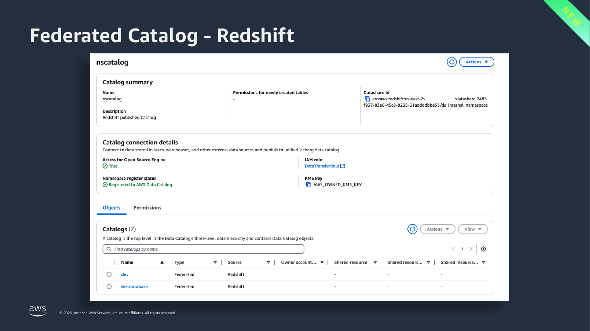

### Slide notes

Visual/diagram slide detailing the federated catalog for Redshift, showing how a Redshift namespace surfaces as a catalog in the lakehouse. Reinforces the mount-without-migration model from the prior slide.

[Narration MP3](../source/decks/audio/m5/slide-5.mp3)

## Slide 6

Query RMS

Querying RMS tables

From AWS analytics services and third-party engines.

### Slide notes

How managed RMS tables are queried, and how Redshift writes work via Lake Formation credential vending.

[Narration MP3](../source/decks/audio/m5/slide-6.mp3)

## Slide 7

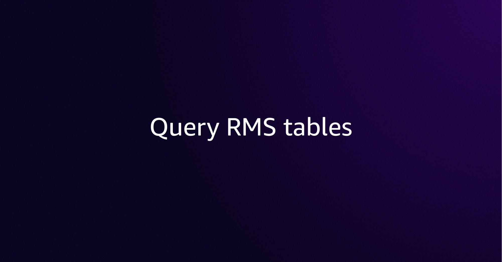

### Slide notes

Section divider introducing how to query RMS tables.

[Narration MP3](../source/decks/audio/m5/slide-7.mp3)

## Slide 8

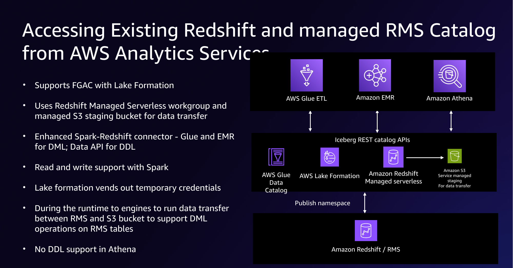

### Slide notes

In order for open-source engines to access RMS tables in RedLake, an intermediate S3 bucket is needed to transfer data from RMS format to open formats such as parquet. The intermediate staging bucket is created and managed by RedLake service in the customer account. A data lake admin must create an IAM role ( we call it DataTransferRole) that’s used by the service to transfer data in/out of the bucket. Customer need not take any action to create or manage the bucket. By default, all data in staging bucket are encrypted using a service managed KMS key. Customers can optionally provide a customer managed KMS key if they want to encrypt the data using thier own KMS keys. The role and intermediate S3 buckets will be registered automatically in Lakeformation by the service. Lake formation vends out temporary credentials during the runtime to engines to run data transfer between RMS and S3 bucket to support DML operations on RMS tables.

[Narration MP3](../source/decks/audio/m5/slide-8.mp3)

## Slide 9

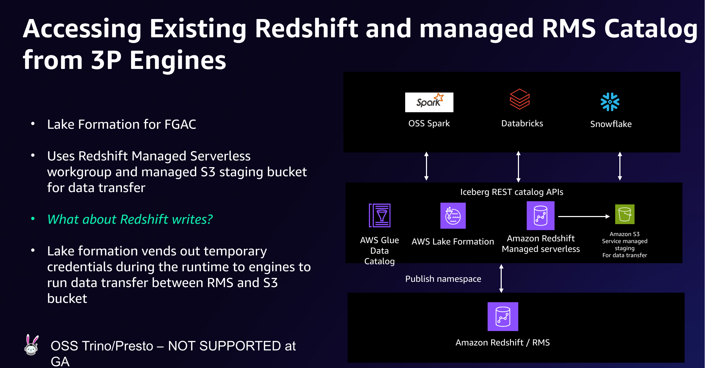

### Slide notes

Explains how third-party engines access existing Redshift and managed RMS catalogs, and how Redshift writes work. Lake Formation provides FGAC and vends temporary credentials at runtime to run data transfer between RMS and a service-managed S3 staging bucket, using a Redshift managed serverless workgroup. OSS Trino/Presto is not supported at GA. Engines such as OSS Spark, Snowflake, and Databricks connect via the Iceberg REST catalog.

[Narration MP3](../source/decks/audio/m5/slide-9.mp3)

## Slide 10

Bring Your Own Redshift

Bring your Redshift data warehouse

Register and mount an existing Redshift warehouse — without migrating data.

### Slide notes

How to bring an existing Amazon Redshift data warehouse into the lakehouse as a federated catalog, with no data movement.

[Narration MP3](../source/decks/audio/m5/slide-10.mp3)

## Slide 11

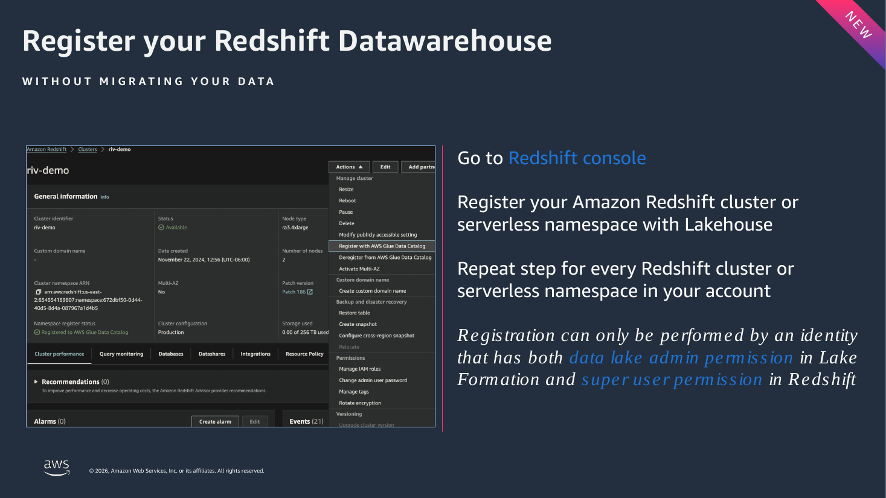

### Slide notes

Register your Redshift data warehouse without migrating data. From the Redshift console, register your Redshift cluster or serverless namespace with the lakehouse, repeating for each cluster/namespace. Registration requires an identity with both data-lake-admin permission in Lake Formation and superuser permission in Redshift.

[Narration MP3](../source/decks/audio/m5/slide-11.mp3)

## Slide 12

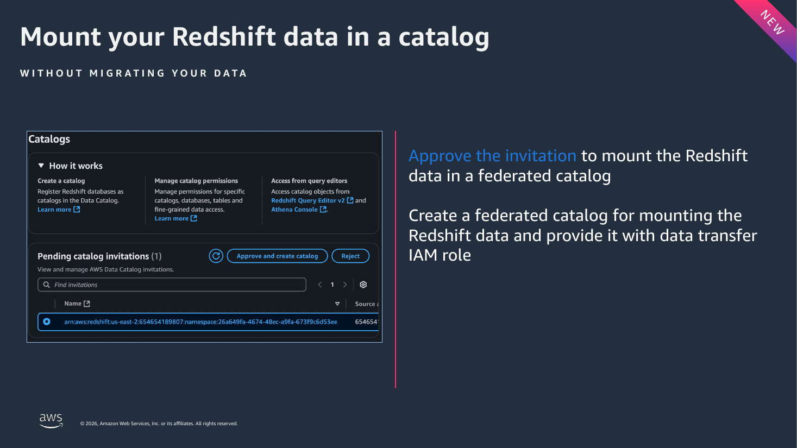

### Slide notes

Mount your Redshift data in a catalog without migrating data. Approve the invitation to mount the Redshift data into a federated catalog, then create the federated catalog for the mounted data and provide it with a data-transfer IAM role.

[Narration MP3](../source/decks/audio/m5/slide-12.mp3)

## Slide 13

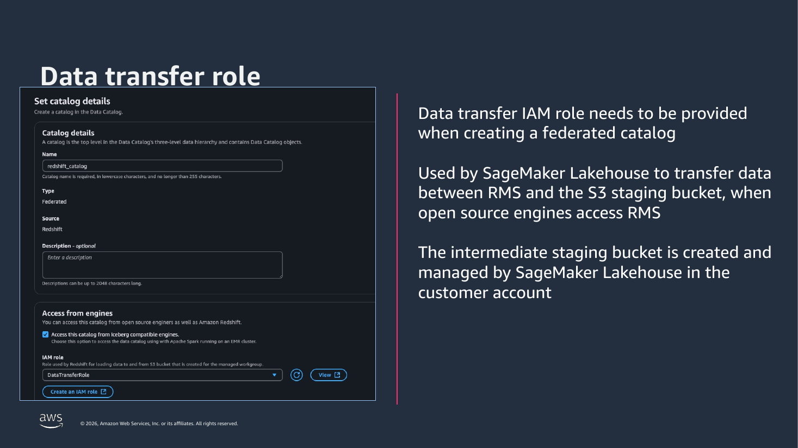

### Slide notes

Data-transfer role. A data-transfer IAM role is supplied when creating a federated catalog. SageMaker Lakehouse uses it to move data between RMS and an S3 staging bucket when open-source engines access RMS. The intermediate staging bucket is created and managed by SageMaker Lakehouse in the customer's account.

[Narration MP3](../source/decks/audio/m5/slide-13.mp3)

## Slide 14

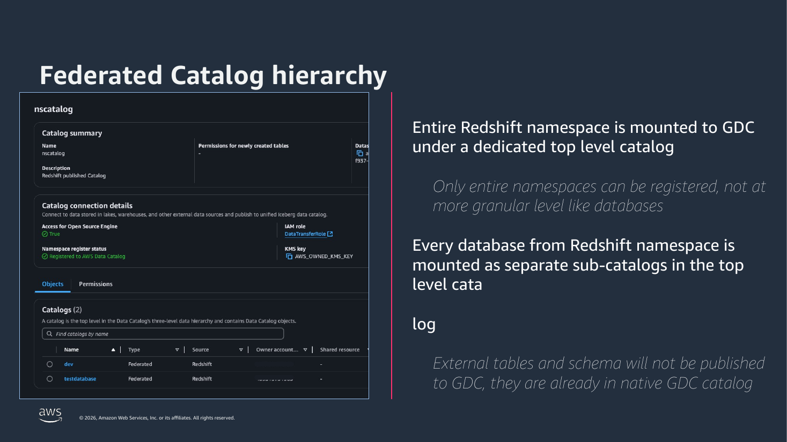

### Slide notes

Federated catalog hierarchy for Redshift. The entire Redshift namespace mounts to the Glue Data Catalog under a dedicated top-level catalog; only whole namespaces can be registered, not individual databases. Each database in the namespace mounts as a separate sub-catalog. External tables and schemas are not re-published because they already live in the native Glue catalog.

[Narration MP3](../source/decks/audio/m5/slide-14.mp3)

## Slide 15

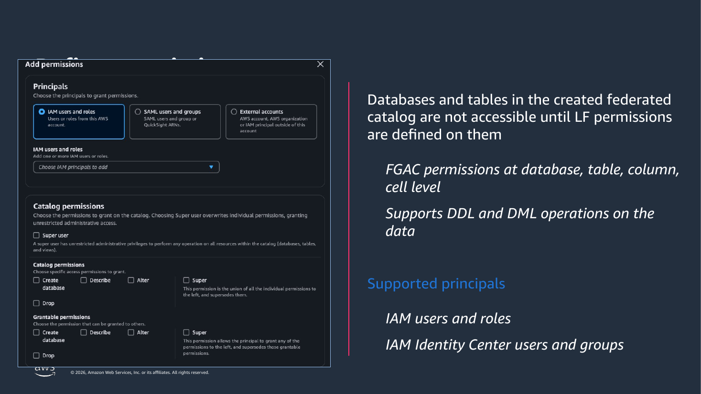

### Slide notes

Defining permissions on the federated catalog. Databases and tables are not accessible until Lake Formation permissions are defined. FGAC is available at database, table, column, and cell level, and both DDL and DML operations are supported. Supported principals include IAM users and roles and IAM Identity Center users and groups.

[Narration MP3](../source/decks/audio/m5/slide-15.mp3)

## Slide 16

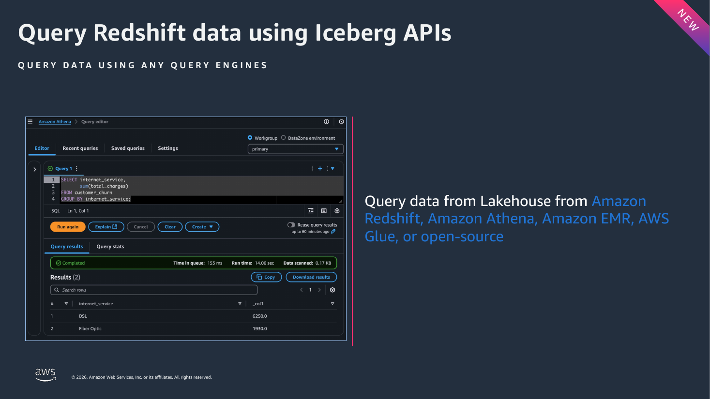

### Slide notes

Query Redshift data using Iceberg APIs from any engine of choice, Amazon Redshift, Amazon Athena, Amazon EMR, AWS Glue, or open-source engines, all reading the same lakehouse data.

[Narration MP3](../source/decks/audio/m5/slide-16.mp3)

## Slide 17

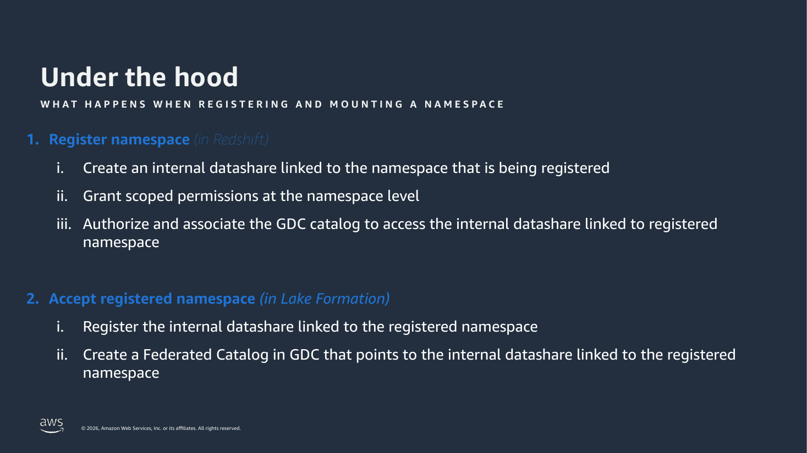

### Slide notes

Under the hood of registering and mounting a namespace. On the Redshift side: create an internal datashare linked to the namespace, grant scoped permissions at the namespace level, and authorize the Glue Data Catalog to access that datashare. On the Lake Formation side: accept the registered namespace, register the internal datashare, and create a federated catalog in Glue that points to it.

[Narration MP3](../source/decks/audio/m5/slide-17.mp3)

## Slide 18

Create in RMS

Create data lakes in Redshift Managed Storage

Create SQL-optimized datasets in RMS from within the lakehouse.

### Slide notes

Creating new datasets directly in RMS via a managed catalog, optimized for SQL workloads without managing Redshift clusters.

[Narration MP3](../source/decks/audio/m5/slide-18.mp3)

## Slide 19

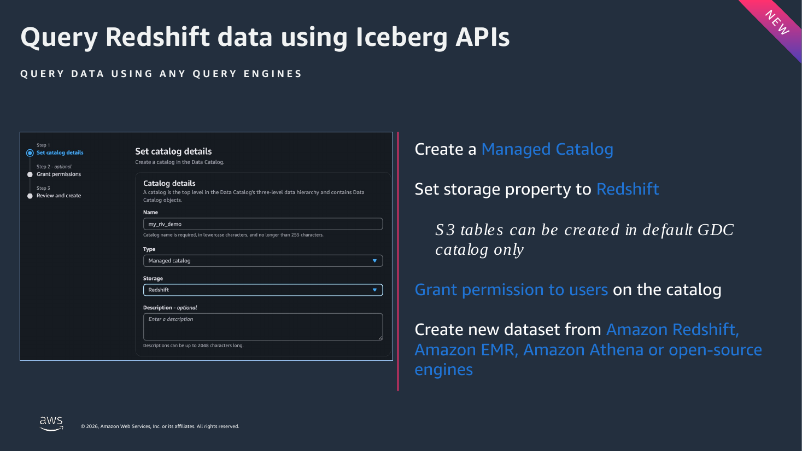

### Slide notes

Creating datasets in RMS via a managed catalog. Create a managed catalog and set its storage property to Redshift (S3 tables can only be created in the default Glue catalog), grant users permission on the catalog, and create new datasets from Amazon Redshift, EMR, Athena, or open-source engines.

[Narration MP3](../source/decks/audio/m5/slide-19.mp3)

## Slide 20

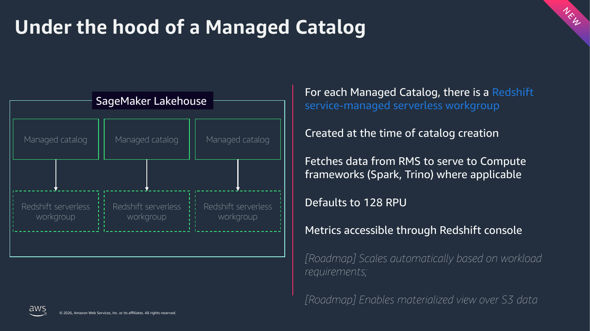

### Slide notes

Under the hood of a managed catalog. Each managed catalog has a Redshift service-managed serverless workgroup, created with the catalog, that fetches data from RMS to serve compute frameworks like Spark and Trino. It defaults to 128 RPU, with metrics in the Redshift console. Roadmap items: automatic scaling based on workload and materialized views over S3 data.

[Narration MP3](../source/decks/audio/m5/slide-20.mp3)

## Slide 21

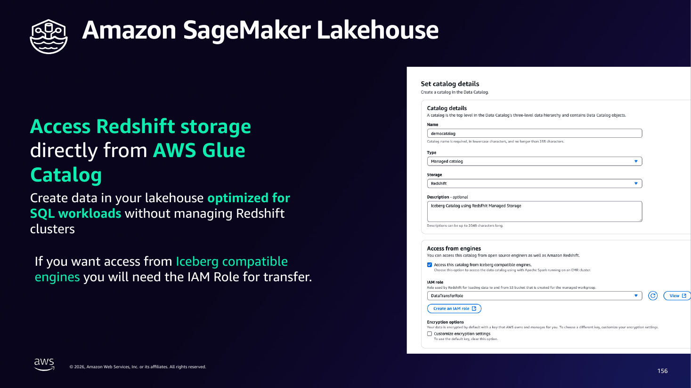

### Slide notes

Positions RMS access directly from the Glue Data Catalog: create data in your lakehouse optimized for SQL workloads without managing Redshift clusters. If you need access from Iceberg-compatible engines, you provide the IAM transfer role for moving data between RMS and S3.

[Narration MP3](../source/decks/audio/m5/slide-21.mp3)

## Slide 22

Query & Unify

Query your lakehouse & unify Redshift + S3

Query RMS from any engine and combine Redshift with S3 data-lake tables.

### Slide notes

Querying RMS from Apache Spark and other engines, the Redshift consumer experience on published data, and unifying Redshift with the S3 data lake via Redshift Spectrum with Lake Formation FGAC.

[Narration MP3](../source/decks/audio/m5/slide-22.mp3)

## Slide 23

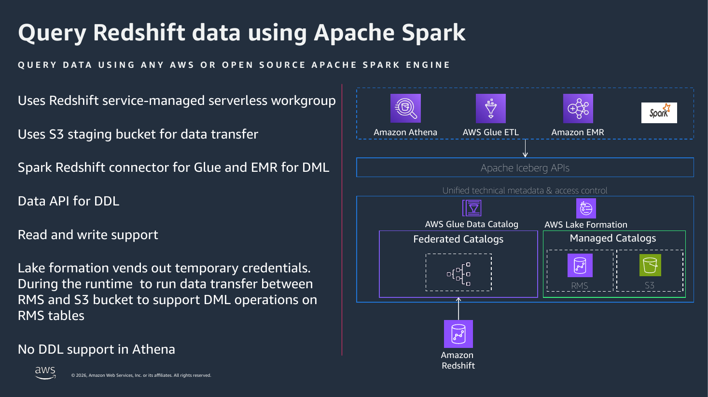

### Slide notes

Query Redshift data using Apache Spark (AWS or open-source Spark). Reads and writes go through a Redshift service-managed serverless workgroup with an S3 staging bucket for transfer, using the Spark-Redshift connector (Glue/EMR) for DML and the Data API for DDL. Lake Formation vends temporary credentials at runtime to move data between RMS and S3 for DML on RMS tables. Athena does not support DDL in this path.

[Narration MP3](../source/decks/audio/m5/slide-23.mp3)

## Slide 24

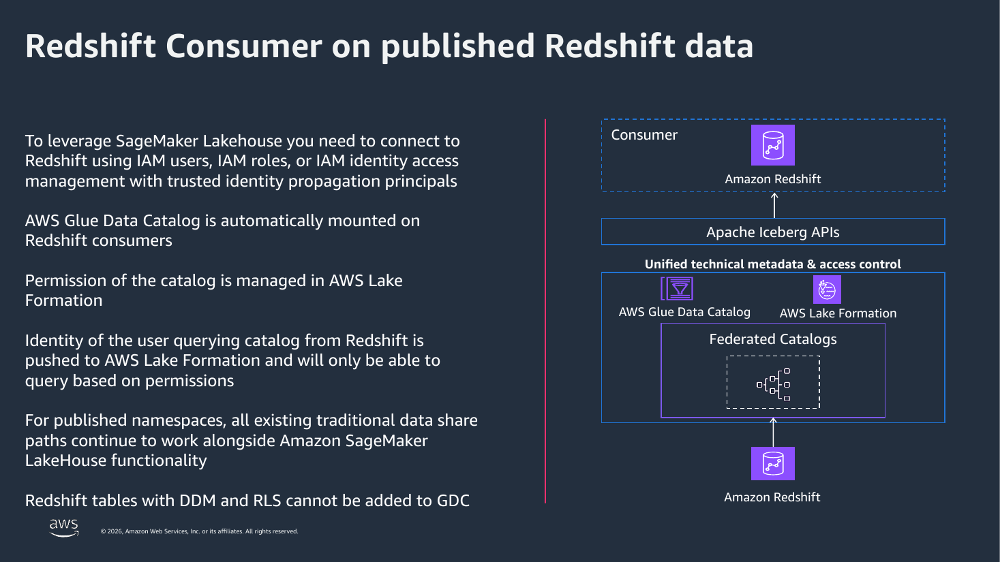

### Slide notes

Redshift consumer on published Redshift data. Connect to Redshift using IAM users, IAM roles, or IAM Identity Center with trusted identity propagation. The Glue Data Catalog is automatically mounted on Redshift consumers, with catalog permissions managed in Lake Formation; the querying user's identity is propagated to Lake Formation so results respect their permissions. Existing traditional datashare paths keep working alongside lakehouse functionality. Redshift tables with dynamic data masking (DDM) and row-level security (RLS) cannot be added to the Glue Data Catalog.

[Narration MP3](../source/decks/audio/m5/slide-24.mp3)

## Slide 25

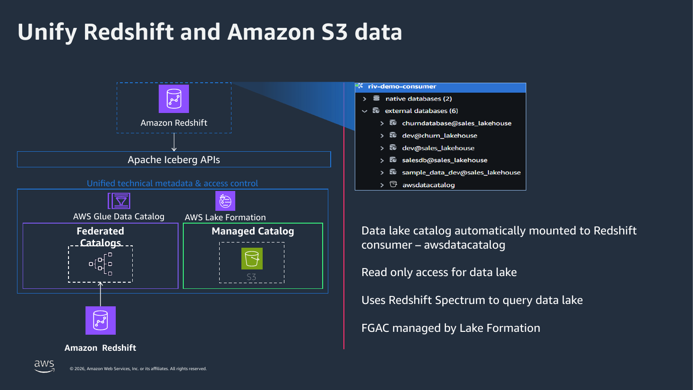

### Slide notes

Unify Redshift and Amazon S3 data. The data-lake catalog is automatically mounted to the Redshift consumer as awsdatacatalog, with read-only access to the data lake, queried via Redshift Spectrum, and FGAC managed by Lake Formation.

[Narration MP3](../source/decks/audio/m5/slide-25.mp3)

## Slide 26

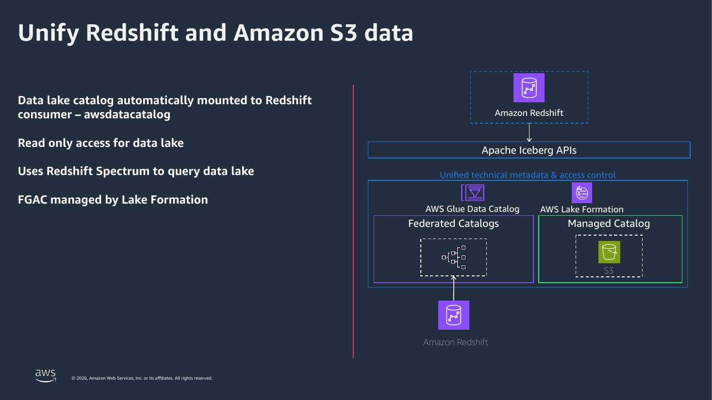

### Slide notes

Diagram of unifying Redshift and S3 data: the Glue Data Catalog and Lake Formation sit over managed and federated catalogs; the data-lake catalog (awsdatacatalog) is auto-mounted read-only to the Redshift consumer and queried through Redshift Spectrum with Lake Formation FGAC.

[Narration MP3](../source/decks/audio/m5/slide-26.mp3)

## Slide 27

Module 5 · Summary

Redshift & RMS — recap

- RMS is ACID, SQL-optimized storage inside the lakehouse, accessible from many engines

- Bring existing Redshift warehouses in as federated catalogs — no data movement

- Create new RMS datasets via managed catalogs without managing clusters

- Unify Redshift and S3 data under one catalog with consistent Lake Formation governance

### Slide notes

Recap of the Redshift/RMS deep dive.

[Narration MP3](../source/decks/audio/m5/slide-27.mp3)
