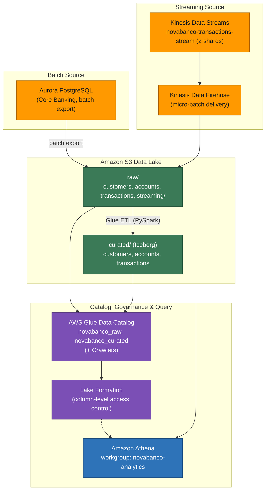

# Module 1 Demo — Foundations

> **Phase 1 of 3** of the *NovaBanco* progressive demo. In this phase we build the **data-lake foundations**: a multi-zone data lake on Amazon S3, a Glue Data Catalog, Lake Formation governance, a curated Apache Iceberg layer, and real-time streaming with Kinesis. Phases 2 and 3 build on top of this same environment.

---

## Modern Data Architecture Foundations

**Theme:** Lakehouse foundations, Data Mesh concepts, and streaming basics.

### What you'll see in this demo

- A multi-zone data lake (raw → curated) on Amazon S3
- AWS Glue Crawlers discovering schema and building a catalog
- AWS Lake Formation enforcing column-level security (hiding PII)
- Amazon Athena querying data in place with SQL
- An Amazon Kinesis stream ingesting transactions in real time

### Services in this phase

| Service | Role | Configuration |
|---------|------|---------------|
| Amazon S3 | Data lake storage | Single bucket, zone prefixes, lifecycle policies |
| AWS Glue Data Catalog | Metadata management | Databases: `novabanco_raw`, `novabanco_curated` |
| AWS Glue Crawlers | Schema discovery | Crawler `novabanco-raw-crawler` → one table per `raw/` folder |
| AWS Glue ETL | Data transformation | PySpark job: raw → curated (Parquet → Iceberg) |
| AWS Lake Formation | Governance | Database-level + column-level permissions |
| Amazon Athena | SQL analytics | Workgroup: `novabanco-analytics` |
| Amazon Kinesis Data Streams | Real-time ingestion | Stream: `novabanco-transactions-stream` (2 shards) |
| Amazon Kinesis Data Firehose | Stream → S3 delivery | Delivery stream to `raw/streaming/` |

### Architecture at this stage



---

## Demo walk-through

### Step 1.1 — The data lake zones

NovaBanco has batch-exported its core banking data into Amazon S3. The lake is organized into zones: **raw → curated → enriched → consumption**. Raw data lands as-is; each later zone is more refined and trusted.

In the S3 bucket `novabanco-data-lake-…`, the raw zone holds one table per folder:

- `raw/customers/`, `raw/accounts/`, `raw/transactions/` — each a single optimized **Parquet** file in this demo (in production, large tables like transactions would be partitioned, e.g. by date).
- `raw/streaming/` — real-time data written by Kinesis Firehose using **Hive-style partitions**, for example `raw/streaming/year=2026/month=09/day=07/hour=01/`. This is a good example of partitioning in action.

**Why it matters:** storing data in open, columnar formats on low-cost object storage — and deciding how to read it later — is the foundation of the lake. Compare optimized Parquet against raw CSV/JSON to see the difference.

### Step 1.2 — Make the data discoverable with the Glue Catalog

The first step toward analytics is making data **discoverable**. AWS Glue Crawlers infer schema automatically and register tables in the Glue Data Catalog. The catalog becomes the "contract" between data producers and consumers — and in a Data Mesh, each domain team owns and publishes its own data products this way.

The crawler `novabanco-raw-crawler` scans `s3://novabanco-data-lake-…/raw/` and populates the `novabanco_raw` database. After it runs, you can browse **Databases → novabanco_raw → Tables** and inspect the `customers` schema, partitions, and table properties.

Validate the catalog with a quick query in Athena:

```sql
-- Customers by segment
SELECT segment, COUNT(*) AS customer_count
FROM novabanco_raw.customers
GROUP BY segment
ORDER BY customer_count DESC;
```

### Step 1.3 — Govern access with Lake Formation

In banking, not everyone should see customer PII. AWS Lake Formation adds **column-level and row-level security** on top of the catalog, replacing complex IAM policies with a central governance model: the compliance team defines *who* can see *what*.

Three personas are governed differently against the same `customers` table:

| Persona | Database | Table | Columns visible |
|---------|----------|-------|-----------------|
| Analyst | `novabanco_raw` | customers | Non-PII only: customer_id, segment, city, state, country, kyc_status, risk_rating, onboarding_date, channel_preference |
| Compliance | `novabanco_raw` | customers | All columns, including PII |
| Data Engineer | `novabanco_raw` | all tables | All columns |

**The effect to observe:** run the *same* query as an analyst versus as compliance and you get *different governed results*. The analyst's results omit PII columns such as `national_id`, `email`, and `phone`; compliance sees them all.

```sql
-- The same query returns different columns depending on the querying persona's
-- Lake Formation permissions.
SELECT * FROM novabanco_raw.customers LIMIT 5;
```

> **Principle of least privilege for data:** the fraud team can analyze transaction patterns without ever seeing customer identity, while the compliance team can see everything it needs for regulatory reporting — all from one governed copy of the data.

### Step 1.4 — Build the curated layer with Glue ETL

Raw data is messy, so we transform it into a **curated, trusted layer** stored as **Apache Iceberg** tables. Iceberg brings ACID transactions, time travel, and schema evolution — the foundation of the lakehouse pattern — and AWS Glue ETL runs the transformation serverless, with no clusters to manage.

The Glue job `novabanco-raw-to-curated` reads each raw table (governed by Lake Formation) and writes it back as an Iceberg v2 table. The core of the PySpark logic:

```python
from pyspark.sql import SparkSession

# Define an Iceberg-backed Glue catalog for the curated warehouse location.
spark = (
    SparkSession.builder
    .config("spark.sql.catalog.glue_catalog", "org.apache.iceberg.spark.SparkCatalog")
    .config("spark.sql.catalog.glue_catalog.warehouse", "s3://<data-lake-bucket>/curated/")
    .config("spark.sql.catalog.glue_catalog.catalog-impl", "org.apache.iceberg.aws.glue.GlueCatalog")
    .config("spark.sql.catalog.glue_catalog.io-impl", "org.apache.iceberg.aws.s3.S3FileIO")
    .getOrCreate()
)

# Transform each raw table into a curated Iceberg table.
for table in ["customers", "accounts", "transactions"]:
    df = spark.table(f"glue_catalog.novabanco_raw.{table}")
    (df.writeTo(f"glue_catalog.novabanco_curated.{table}")
       .tableProperty("format-version", "2")
       .tableProperty("write.parquet.compression-codec", "zstd")
       .createOrReplace())
```

**Iceberg benefits to highlight:** time travel (query historical snapshots), schema evolution (add columns without rewriting), and partition evolution (change partitioning without moving data).

Explore the curated tables and their Iceberg metadata in Athena:

```sql
-- Query the curated Iceberg table
SELECT * FROM novabanco_curated.customers LIMIT 10;

-- Inspect Iceberg snapshots (each write creates a snapshot)
SELECT committed_at, snapshot_id, operation
FROM "novabanco_curated"."customers$snapshots"
ORDER BY committed_at DESC;

-- Time travel: read the table as of a point in time
-- (choose a timestamp at/after the most recent snapshot's committed_at)
SELECT COUNT(*) FROM novabanco_curated.customers
FOR TIMESTAMP AS OF current_timestamp - interval '30' second;
```

### Step 1.5 — Real-time streaming

Batch processing alone is not enough for use cases like fraud detection — we need transactions flowing in **real time**. Kinesis Data Streams is the real-time ingestion pipe, and Kinesis Data Firehose delivers those records to S3 in micro-batches. This is the "streaming" leg of the modern data architecture.

- The stream `novabanco-transactions-stream` (2 shards, 24-hour retention) receives transactions.
- Firehose delivers them to `s3://novabanco-data-lake-…/raw/streaming/`, buffering ~60 seconds or 1 MB, partitioned by `year/month/day/hour`.

Once records land, they're cataloged and queryable in Athena. Firehose delivers raw JSON, so `transaction_date` arrives as a string — parse it with `from_iso8601_timestamp`:

```sql
-- Near-real-time view of streamed transactions
SELECT
    date_trunc('minute', from_iso8601_timestamp(transaction_date)) AS minute,
    COUNT(*)    AS txn_count,
    SUM(amount) AS total_amount
FROM novabanco_raw.streaming
WHERE from_iso8601_timestamp(transaction_date) > current_timestamp - interval '15' minute
GROUP BY 1
ORDER BY 1 DESC;
```

### Step 1.6 — Data Mesh concepts (wrap-up)

Everything built in this phase maps to the four **Data Mesh** principles:

1. **Domain ownership** — each business unit owns its own data pipeline.
2. **Data as a product** — the curated layer *is* the data product.
3. **Self-serve platform** — Athena plus the catalog lets consumers help themselves.
4. **Federated governance** — Lake Formation policies enforce the rules centrally.

In **Module 2**, we'll see how the SageMaker Catalog makes these data products truly discoverable across the whole organization.

---

## What the environment looks like now

- ✅ S3 bucket with raw + curated zones populated
- ✅ Glue Data Catalog with `novabanco_raw` and `novabanco_curated` databases
- ✅ Iceberg tables in the curated zone
- ✅ Lake Formation column-level permissions in effect
- ✅ Athena workgroup operational
- ✅ Kinesis stream receiving transactions, delivered to `raw/streaming/`

---

**Next:** Module 2 — The Open Data Platform (SageMaker Catalog & Lakehouse). The environment carries forward into the next phase.
