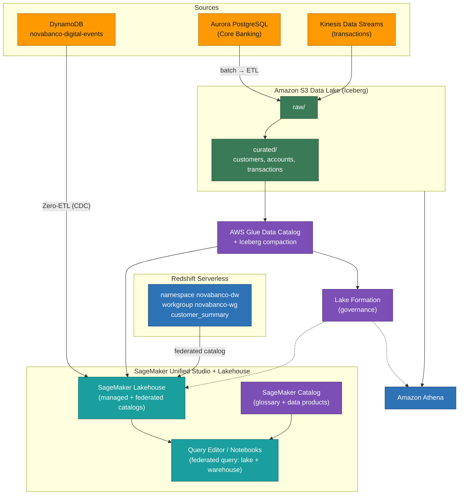

# Module 2 Demo — The Open Data Platform

> **Phase 2 of 3** of the *NovaBanco* progressive demo: **SageMaker Catalog & Lakehouse**. Building on the Phase 1 foundations, we unify the S3 data lake and the Redshift warehouse into one governed lakehouse, add Zero-ETL from DynamoDB, make data discoverable through the SageMaker Catalog, and maintain the Iceberg tables. Phase 3 builds on this same environment.

---

## The Open Data Platform — SageMaker Catalog & Lakehouse

**Starting state:** Phase 1 is in place — raw data in S3, a Glue catalog, Lake Formation governance, Athena, and a Kinesis stream.

**Theme:** A unified lakehouse, Zero-ETL, data discovery, and Iceberg maintenance.

### What you'll see in this demo

- SageMaker Lakehouse unifying the S3 lake and the Redshift warehouse
- Zero-ETL replicating DynamoDB data into the lakehouse
- The SageMaker Catalog: a business glossary and published data products
- One query spanning the lake **and** the warehouse, governed per SSO identity
- Apache Iceberg table maintenance

### Services in this phase

| Service | Role |
|---------|------|
| SageMaker Unified Studio | Unified workspace (single pane of glass) |
| SageMaker Catalog | Discovery & governance (glossary + data products) |
| Redshift Serverless | Warehouse — namespace `novabanco-dw`, workgroup `novabanco-wg` |
| SageMaker Lakehouse | Unified access (managed + federated catalogs) |
| Zero-ETL (DynamoDB) | `novabanco-digital-events` → `novabanco_lakehouse` |
| AWS Glue / Athena | Iceberg maintenance (OPTIMIZE / VACUUM) |

### Architecture



---

## Demo walk-through

**The story:** an analyst signs in to SageMaker Unified Studio with their SSO identity and, from one catalog, runs a single query across the S3 lake **and** the Redshift warehouse — governed per person, with no passwords and no data copy.

### Step 2.1 — Sign in to Unified Studio

Until now the demo jumped between separate consoles — Glue, Athena, Lake Formation, Redshift. **SageMaker Unified Studio** is the single pane of glass for all of them. You sign in once with your corporate SSO identity — no database passwords, no IAM roles to copy. Both the S3 lake and the Redshift warehouse are governed by **one Lake Formation layer**: the warehouse is registered as a Lake-Formation-managed catalog (`novabanco_warehouse`), so the same permission model applies no matter which engine runs the query.

Inside the `novabanco-lakehouse` project's **Query editor**, the **Data explorer** shows both surfaces already scoped to your identity:

- **S3 lake** — `awsdatacatalog` → `novabanco_curated` (customers, accounts, transactions)
- **Redshift warehouse** — `novabanco_warehouse` catalog → `dev` → `novabanco_warehouse` → `customer_summary`

### Step 2.2 — One query across lake + warehouse

The S3 lake handles big historical scans cheaply; some questions need sub-second answers — that's the warehouse. The lakehouse lets **one query span both**, with no ETL to move data between them, and **one Lake Formation layer governs both** the lake and the warehouse.

This single statement joins the Redshift warehouse table `customer_summary` to the lake's Iceberg `transactions` table:

```sql
-- Run in the project's Athena cell.
-- warehouse: RMS catalog (LF-governed); novabanco_curated.* -> S3 lake (Iceberg)
SELECT
    cs.customer_id, cs.full_name, cs.segment, cs.total_balance,
    COUNT(t.transaction_id) AS txns,
    AVG(t.amount)           AS avg_txn_amount
FROM "novabanco_warehouse/dev".novabanco_warehouse.customer_summary cs
JOIN awsdatacatalog.novabanco_curated.transactions t
    ON cs.customer_id = t.customer_id
GROUP BY 1, 2, 3, 4
HAVING COUNT(t.transaction_id) > 10
ORDER BY cs.total_balance DESC
LIMIT 20;
```

> **Run this in the project's Athena query cell.** Athena reads both the S3 lake and the LF-managed warehouse catalog, so the cross-source join runs directly in Studio.
>
> **Centralized governance:** the lake **and** the warehouse are governed by **one Lake Formation layer**. The warehouse is a Lake-Formation-managed (RMS) catalog, so the same per-user grants apply across Athena, Redshift, and Spark. One identity, one governance layer, one query.

### Step 2.3 — Zero-ETL from DynamoDB

NovaBanco's mobile app and web portal write events to DynamoDB. The traditional approach would be to build and maintain a Glue ETL pipeline. **Zero-ETL** instead lets AWS manage the replication: data lands in the lakehouse as Apache Iceberg and is queryable within minutes — and it consumes no capacity from the DynamoDB production table.

The integration `novabanco-dynamodb-zetl` replicates `novabanco-digital-events` into the `novabanco_lakehouse` database, where the table `novabanco_digital_events` appears automatically. Query it in Athena:

```sql
-- `timestamp` is epoch MILLISECONDS; Athena/Trino uses to_unixtime (not EXTRACT EPOCH).
SELECT event_type, channel, COUNT(*) AS event_count,
       COUNT(DISTINCT customer_id) AS unique_customers
FROM novabanco_lakehouse.novabanco_digital_events
WHERE timestamp > (CAST(to_unixtime(current_timestamp) AS BIGINT) - 86400) * 1000
GROUP BY event_type, channel
ORDER BY event_count DESC;
```

The replication is **continuous** (change data capture), so new DynamoDB records flow into the lakehouse automatically. CDC refresh is on the order of ~15 minutes, not instant — a newly written record shows up after a short delay, not immediately.

### Step 2.4 — SageMaker Catalog: discovery & governance

We now have data in S3, Redshift, and DynamoDB — so how does a business analyst *find* the right data? The **SageMaker Catalog** is the organization's data marketplace, and its **business glossary** ensures everyone speaks the same language. This is the Data Mesh "self-serve data platform" layer.

A business glossary defines shared terms, for example:

| Term | Definition |
|------|-----------|
| Customer 360 | Unified view of a customer across channels and products |
| AML Risk Score | Anti-money-laundering probability, 0–1 |
| PEP | Politically Exposed Person — requires enhanced due diligence |
| MCC | Merchant Category Code |
| CTR | Currency Transaction Report (transactions > $10,000) |

Curated tables are then published as **data products** that analysts can discover, understand, and subscribe to:

| Data product | Source | Access approval |
|--------------|--------|-----------------|
| Customer Master | `novabanco_curated.customers` | Required |
| Transaction History | `novabanco_curated.transactions` | Required (PII) |
| Digital Engagement Events | `novabanco_lakehouse.novabanco_digital_events` | Not required |

**Discovery in action:** search for `customer`, open **Customer Master**, and review its description, glossary terms, schema, and lineage, then **Subscribe** to request access. Sensitivity labels (for example `sensitivity=pii`) carry into the catalog, so users see what's sensitive *before* requesting it — and actually reading PII still requires the compliance persona's Lake Formation grant from Module 1.

### Step 2.5 — Iceberg maintenance

Iceberg tables accumulate small files over time (especially with streaming). **Compaction** merges small files for better query performance, and **snapshot expiration** prevents unbounded metadata growth — these are the "DBA tasks" of the lakehouse world. They run in Athena:

```sql
-- Inspect file health (many small files hurt performance)
SELECT file_path, file_size_in_bytes, record_count
FROM "novabanco_curated"."transactions$files"
ORDER BY file_size_in_bytes ASC LIMIT 20;

-- Compaction: merge small files
OPTIMIZE novabanco_curated.transactions REWRITE DATA USING BIN_PACK;

-- Expire old snapshots + remove orphan files (Athena uses VACUUM)
ALTER TABLE novabanco_curated.transactions
SET TBLPROPERTIES ('vacuum_max_snapshot_age_seconds' = '86400');   -- keep 24h
VACUUM novabanco_curated.transactions;
```

Iceberg also supports **time travel** — reading the table as of an earlier point in time. `OPTIMIZE`+`VACUUM` above collapse the history to one fresh snapshot, so travelling back 5 min errors `No version history table ... at or before ...`. Create a new snapshot first, then travel back to just before it:

```sql
-- 1. Baseline count (current snapshot).
SELECT COUNT(*) AS current_count FROM novabanco_curated.transactions;

-- 2. Make a change -> new snapshot.
INSERT INTO novabanco_curated.transactions
SELECT * FROM novabanco_curated.transactions LIMIT 5;

-- 3. Travel back to BEFORE the insert -> earlier_count is 5 fewer.
SELECT COUNT(*) AS earlier_count FROM novabanco_curated.transactions
FOR TIMESTAMP AS OF (current_timestamp - interval '30' second);
```

> These `$files`, `OPTIMIZE`, and `VACUUM` operations are Athena/Trino-specific (they run against the lake, not the Redshift connection).

### Step 2.6 — Wrap-up

- One query, one login, spanning the S3 lake **and** the Redshift warehouse — with no ETL between them.
- Centralized governance: one Lake Formation layer over both the lake and the warehouse, enforced across every engine.
- S3 holds cheap history, Redshift serves sub-second SQL, DynamoDB flows in via Zero-ETL, and the SageMaker Catalog makes it all discoverable.

This is the single pane of glass, live. **Module 3** builds the BFSI use cases on top of it.

---

## What the environment looks like now

- ✅ SageMaker Unified Studio project (V2 IdC domain), signed in via SSO
- ✅ One catalog spanning the S3 lake + Redshift warehouse; a single query runs as the SSO identity
- ✅ Centralized governance: one Lake Formation layer over both the lake and the warehouse (RMS catalog `novabanco_warehouse`)
- ✅ Redshift Serverless with `customer_summary` loaded
- ✅ Zero-ETL (DynamoDB → Lakehouse) replicating
- ✅ SageMaker Catalog: glossary + 3 data products
- ✅ Iceberg tables compacted and maintained

---

**Previous:** Module 1 — Foundations · **Next:** Module 3 — Data Lake Use Cases for BFSI. The environment carries forward with no teardown.
