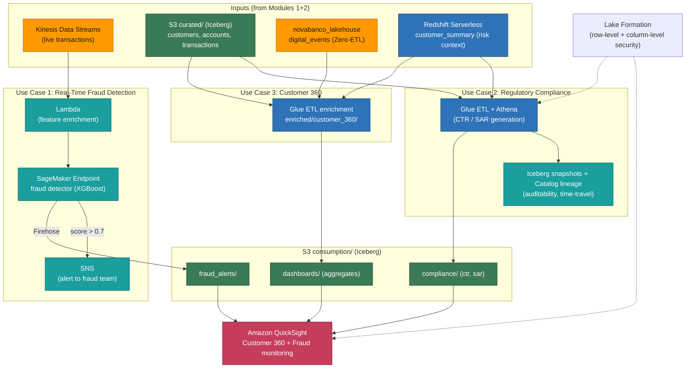

# Module 3 Demo — Data Lake Use Cases for BFSI

> **Phase 3 of 3** of the *NovaBanco* progressive demo. On top of the governed lakehouse from Phases 1 and 2, we build the three universal banking use cases: **real-time fraud detection**, **regulatory compliance**, and **Customer 360** — visualized in an Amazon QuickSight dashboard.

---

## Data Lake Use Cases for BFSI

**Starting state:** the full lakehouse is operational — unified across S3 and Redshift, Zero-ETL is flowing, and data products are discoverable in the SageMaker Catalog.

**Theme:** Fraud detection, regulatory compliance, and Customer 360.

### What you'll see in this demo

- A real-time fraud-scoring pipeline
- Regulatory compliance reporting with full data lineage
- A Customer 360 view powering a QuickSight dashboard
- How the reference architecture maps to real banking requirements

### Services in this phase

| Service | Role |
|---------|------|
| Amazon QuickSight | BI dashboards (Customer 360 + fraud monitoring) |
| Amazon SageMaker (ML) | Fraud detection model for inference |
| Amazon Kinesis | Real-time transaction stream feeding scoring |
| AWS Glue | Enrichment pipelines (Customer 360 aggregation) |

### Architecture at this stage



---

## Demo walk-through

### Step 3.1 — The BFSI reference architecture

Financial institutions share three universal data challenges, and we'll implement all three on the platform built in Modules 1–2:

1. **Fraud & financial crime** → real-time detection
2. **Regulatory compliance** → auditability, lineage, and reports
3. **Customer intelligence** → a 360° view, personalization, and retention

Each use case reuses the data we already have:

| Use case | Data sources | Processing | Output |
|----------|-------------|------------|--------|
| Fraud detection | transactions (stream) + customers (batch) + digital_events (Zero-ETL) | Kinesis → ML scoring → alerts | `consumption/fraud_alerts/` |
| Compliance | curated tables + risk scores | Glue ETL → aggregation → report | `consumption/compliance/` |
| Customer 360 | customers + accounts + transactions + digital_events | Glue ETL → enrichment | `enriched/customer_360/` |

### Step 3.2 — Use case 1: real-time fraud detection

Fraud costs banks billions annually, so **speed of detection is critical**. The approach combines batch ML model training with real-time scoring: the streaming transactions from Module 1 are the input, enriched with the customer risk profile from the Module 2 lakehouse.

**Feature engineering** — build fraud features from curated data (velocity, behavioral, and risk-context signals):

```sql
-- Fraud features: transaction velocity + behavioral flags + customer risk context
CREATE TABLE novabanco_curated.fraud_features
WITH (table_type = 'ICEBERG', format = 'PARQUET') AS
SELECT
    t.account_id,
    t.customer_id,
    -- Velocity features
    COUNT(*) OVER (
        PARTITION BY t.account_id ORDER BY t.transaction_date
        RANGE BETWEEN INTERVAL '1' HOUR PRECEDING AND CURRENT ROW
    ) AS txn_count_1h,
    SUM(t.amount) OVER (
        PARTITION BY t.account_id ORDER BY t.transaction_date
        RANGE BETWEEN INTERVAL '24' HOUR PRECEDING AND CURRENT ROW
    ) AS total_amount_24h,
    -- Behavioral features
    CASE WHEN t.merchant_country != c.country THEN 1 ELSE 0 END AS is_foreign,
    CASE WHEN t.channel = 'online' AND t.amount > 5000 THEN 1 ELSE 0 END AS high_value_online,
    -- Customer risk context (from the Redshift warehouse, via the lakehouse)
    cs.risk_tier,
    cs.total_balance,
    t.fraud_label
FROM novabanco_curated.transactions t
JOIN novabanco_curated.customers c ON t.customer_id = c.customer_id
LEFT JOIN novabanco_warehouse.customer_summary cs ON t.customer_id = cs.customer_id
WHERE t.transaction_date >= CURRENT_DATE - INTERVAL '90' DAY;
```

**Real-time scoring pipeline** — the flow is:

```
Kinesis Stream → Lambda (feature enrichment) → SageMaker Endpoint (scoring)
    → Kinesis Firehose → S3 consumption/fraud_alerts/ (Iceberg)
    → SNS → Alert to the fraud team
```

Each transaction is enriched, scored by the model, and — if the fraud score crosses a threshold (e.g. > 0.7) — an alert is published and written to the alerts table. Every score is also written to the consumption layer.

**Query the alerts** the pipeline produces, with a recommended action per score band:

```sql
-- Recent fraud alerts with a recommended action
SELECT
    transaction_id, account_id, amount, merchant_name,
    fraud_score, alert_timestamp,
    CASE
        WHEN fraud_score > 0.9 THEN 'BLOCK'
        WHEN fraud_score > 0.7 THEN 'REVIEW'
        ELSE 'MONITOR'
    END AS recommended_action
FROM novabanco_curated.fraud_alerts
WHERE alert_timestamp > CURRENT_TIMESTAMP - INTERVAL '1' HOUR
ORDER BY fraud_score DESC;
```

### Step 3.3 — Use case 2: regulatory compliance

Banks must file **CTRs** (Currency Transaction Reports) for transactions over $10,000 and **SARs** (Suspicious Activity Reports) for unusual patterns — and regulators want to know *where the data came from* (lineage). Lake Formation plus Iceberg time-travel makes compliance **auditable**.

**Generate a CTR report** — all completed transactions over $10,000 in a period, with audit fields baked in:

```sql
-- Currency Transaction Report: transactions >= $10,000
CREATE TABLE novabanco_curated.ctr_report
WITH (table_type = 'ICEBERG', format = 'PARQUET') AS
SELECT
    t.transaction_id, t.transaction_date, t.amount, t.currency,
    c.customer_id, c.full_name, c.national_id, c.kyc_status, c.pep_flag,
    a.account_id, a.account_type, t.merchant_name, t.channel, t.is_international,
    -- Audit fields for traceability
    CURRENT_TIMESTAMP AS report_generated_at,
    'CTR-AUTO' AS report_batch_id,
    'v2.1'     AS generation_logic_version
FROM novabanco_curated.transactions t
JOIN novabanco_curated.accounts a ON t.account_id = a.account_id
JOIN novabanco_curated.customers c ON a.customer_id = c.customer_id
WHERE t.amount >= 10000
  AND t.status = 'completed';

-- Summary of what was reported
SELECT COUNT(*) AS ctr_count,
       SUM(amount) AS total_reported_amount,
       COUNT(DISTINCT customer_id) AS unique_customers
FROM novabanco_curated.ctr_report;
```

**Data lineage & auditability** — when a regulator asks "how was this report generated, and can you reproduce it exactly?", the answer is traceable end to end: Aurora core banking → S3 raw (batch export) → Glue ETL → S3 curated (Iceberg) → the report query → S3 consumption, each step timestamped and versioned. Iceberg snapshots let you reproduce the exact state:

```sql
-- When was this report generated, and against which data version?
SELECT * FROM "novabanco_curated"."ctr_report$snapshots"
ORDER BY committed_at DESC;

-- Reproduce the report exactly, from a specific Iceberg snapshot
SELECT COUNT(*) FROM novabanco_curated.ctr_report
FOR SYSTEM_VERSION AS OF <snapshot_id>;
```

**Row-level security for compliance** — with Lake Formation row filters, the compliance team can see all regions while a branch manager sees only their own branch's transactions (e.g. a filter like `branch_code = '<the manager's branch>'` applied to the transactions table). Same table, governed rows per persona.

### Step 3.4 — Use case 3: Customer 360 & QuickSight

Customer 360 is the holy grail of banking analytics: it combines core banking, digital behavior, risk scores, and product holdings into one view — and this is where the lakehouse really shines, because it's a **single query across all sources** (S3 lake + Redshift warehouse + Zero-ETL DynamoDB data).

**Build the unified Customer 360 table** — product holdings, transaction behavior, digital engagement, and derived value segments:

```sql
-- Unified Customer 360: banking + behavior + digital engagement
CREATE TABLE novabanco_curated.customer_360
WITH (table_type = 'ICEBERG', format = 'PARQUET') AS
SELECT
    c.customer_id, c.full_name, c.segment, c.city, c.state,
    c.onboarding_date, c.channel_preference, c.risk_rating,

    -- Product holdings (from accounts)
    COUNT(DISTINCT a.account_id) AS total_accounts,
    SUM(a.balance)               AS total_balance,

    -- Transaction behavior (from transactions, last 90 days)
    COUNT(DISTINCT t.transaction_id) AS total_transactions_90d,
    SUM(t.amount)                    AS total_spend_90d,
    AVG(t.amount)                    AS avg_transaction_amount,
    MAX(t.transaction_date)          AS last_transaction_date,

    -- Digital engagement (from Zero-ETL DynamoDB data)
    de.total_digital_events,
    de.login_count_30d,
    de.preferred_digital_channel,

    -- Derived value segment
    CASE
        WHEN SUM(a.balance) > 100000 THEN 'high_value'
        WHEN SUM(a.balance) > 25000  THEN 'medium_value'
        ELSE 'standard'
    END AS value_segment
FROM novabanco_curated.customers c
LEFT JOIN novabanco_curated.accounts a ON c.customer_id = a.customer_id
LEFT JOIN novabanco_curated.transactions t ON a.account_id = t.account_id
    AND t.transaction_date >= CURRENT_DATE - INTERVAL '90' DAY
LEFT JOIN (
    -- Digital engagement aggregated from the Zero-ETL DynamoDB feed
    SELECT customer_id,
           COUNT(*) AS total_digital_events,
           SUM(CASE WHEN event_type = 'login' THEN 1 ELSE 0 END) AS login_count_30d,
           MAX(channel) AS preferred_digital_channel
    FROM novabanco_lakehouse.novabanco_digital_events
    GROUP BY customer_id
) de ON c.customer_id = de.customer_id
GROUP BY
    c.customer_id, c.full_name, c.segment, c.city, c.state,
    c.onboarding_date, c.channel_preference, c.risk_rating,
    de.total_digital_events, de.login_count_30d, de.preferred_digital_channel;
```

**Visualize it in QuickSight** — connect a dataset to the `customer_360` table (via Athena) and build the "NovaBanco Customer Intelligence" dashboard:

| Visual | Type | Data |
|--------|------|------|
| Customer segment distribution | Donut chart | segment breakdown |
| Total balance by segment | KPI cards | total_balance by value_segment |
| Geographic distribution | Filled map | customers by state |
| Digital engagement vs. balance | Scatter plot | digital_events vs. total_balance |
| Product penetration | Stacked bar | account types by segment |
| Risk distribution | Heatmap | risk_rating vs. value_segment |
| Recent fraud alerts | Table | top fraud alerts with scores |

QuickSight **row-level security** maps branch managers to their branches, so each manager sees only their own customers. The dashboard refreshes as new data flows through the pipeline — streaming transactions → curated → Customer 360 → dashboard, and the fraud scores from Use Case 1 appear here too.

### Connecting it all together

Step back and look at the journey — an entire modern banking data platform, built progressively on one account:

1. **Module 1: Foundation** — S3 + catalog + governance + streaming
2. **Module 2: Unification** — lakehouse + Zero-ETL + discovery
3. **Module 3: Value** — fraud + compliance + Customer 360

Each module built on the previous one, with no teardown and no silos. This *is* the modern data architecture pattern for banking.

---

## What the environment looks like now

- ✅ Everything from Modules 1 and 2
- ✅ Fraud detection feature store and scoring pipeline
- ✅ ML model endpoint for real-time scoring
- ✅ CTR compliance reports with full lineage
- ✅ Row-level security for branch isolation
- ✅ Customer 360 enriched table (lake + warehouse + DynamoDB combined)
- ✅ QuickSight dashboard with row-level security

---

**Previous:** Module 2 — The Open Data Platform. This completes the three-phase NovaBanco journey.
