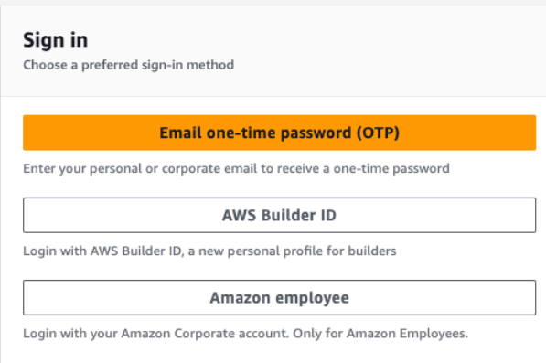
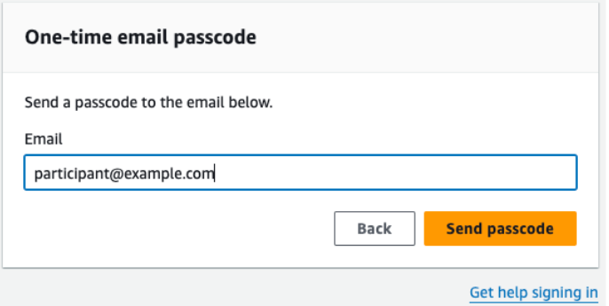
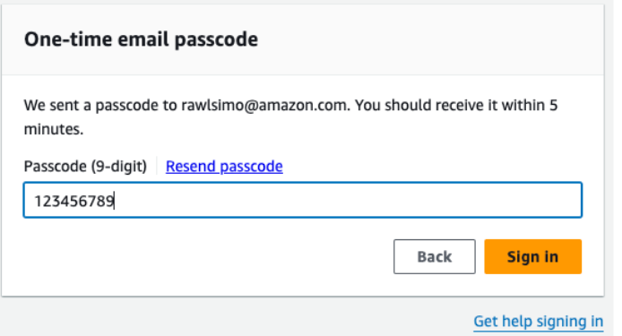
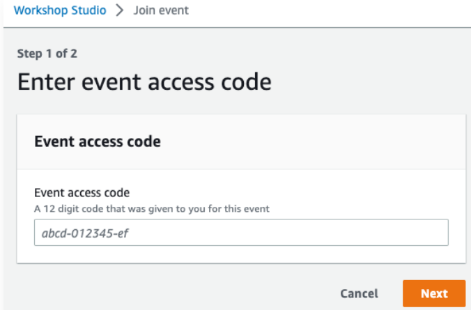
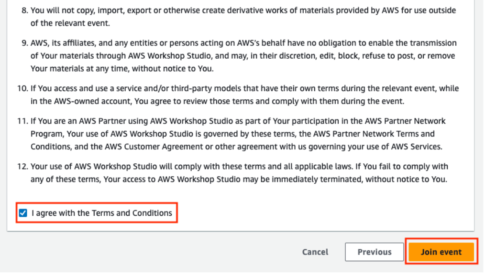

Follow the steps below to gain access to your Workshop Studio AWS account:

1. Open [Workshop Studio](https://catalog.workshops.aws/join)

2. Choose your preferred sign-in method. For AWS guided events, choose Email one-time-password (OTP).

3. Enter your email account and choose Send passcode.

4. The one-time-password will be emailed to the email account within 1-2 minutes. Copy the passcode into the dialog and choose Sign in.

5. If prompted, enter the 12-character Event access code received from the event organizer and choose Next.

6. Read and agree to the Terms and Conditions by selecting I agree with the Terms and Conditions and choose Join event.

