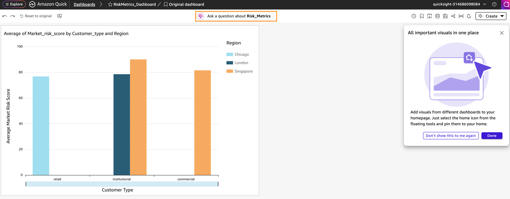
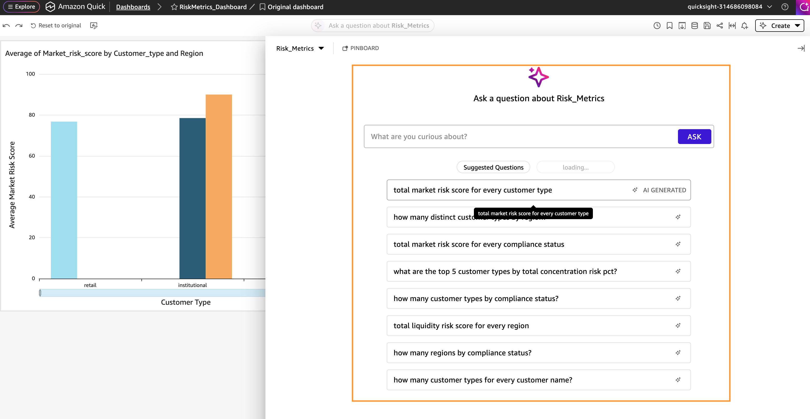
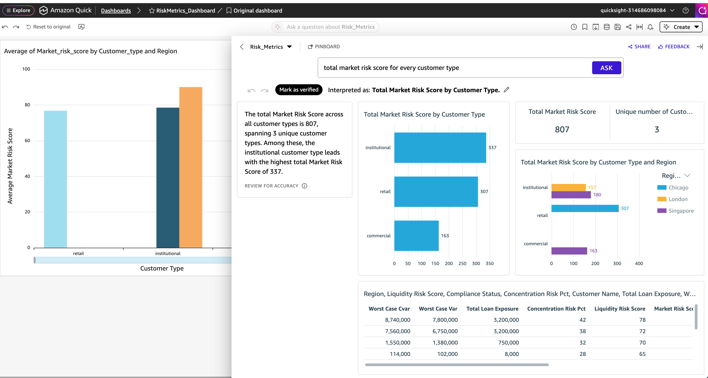

[Dashboard Q&A by Amazon Q in QuickSight](https://docs.aws.amazon.com/quick/latest/userguide/dashboard-qa.html) enables QuickSight Authors to add Data Q&A to their dashboards in one-click. With dashboard Q&A, QuickSight users can ask and answer questions about their data using natural language.

To perform Q&A on the `RiskMetrics_Dashboard` dashboard, execute the following steps:

1. From the top bar of the newly created `RiskMetrics_Dashboard` dashboard, select **Ask a question about Risk_Metrics**.

2. This will open the Q&A panel and provide a set of auto-generated question based on the dashboard. You can choose one of those question and add your own question to the **Ask** section.

3. For this workshop, copy and paste the prompt below and choose **Ask**:

    :code[Total market risk score for every customer type]{showCopyAction=true}
   
   The Q&A feature will produce different visuals showcasing total market risk by customer type and also provide a summary of the output, as shown below.

Thus, from the Quick Sight dashboard, you can slide and dice into the data and generate visuals using the Q&A feature, without building visuals manually. You can also select **Share** from the top right to copy the link to the visuals to share with others.

::alert[**Congratulations!** You've successfully performed Q&A on the published dashboard to further analyze the dashboard data and generate automated visuals and summaries simply by using natural language prompts.]{type=success}