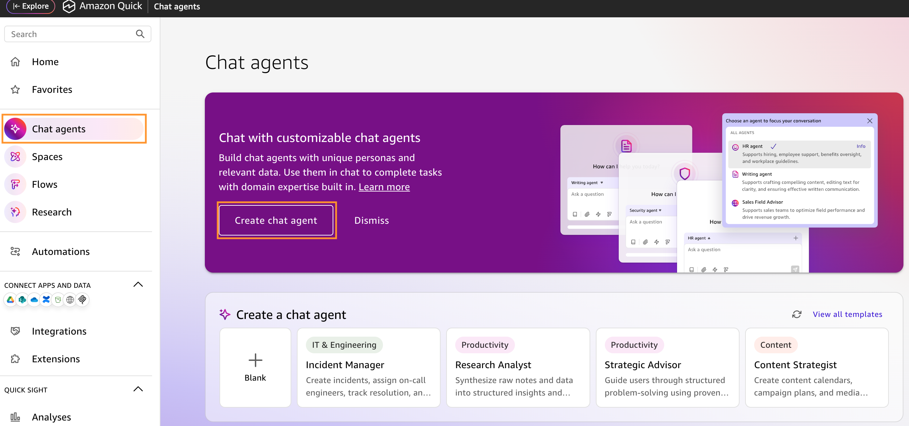
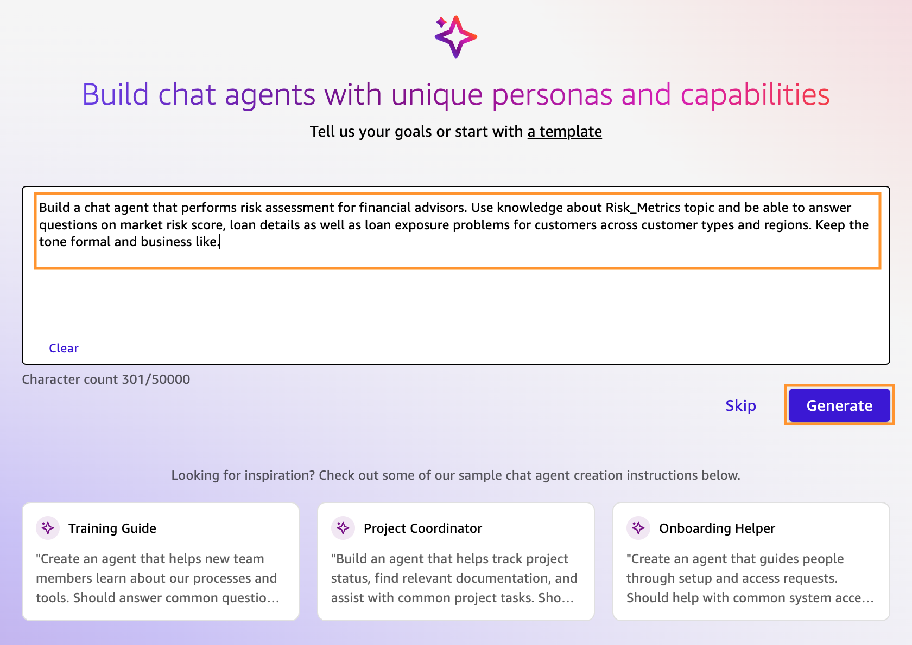
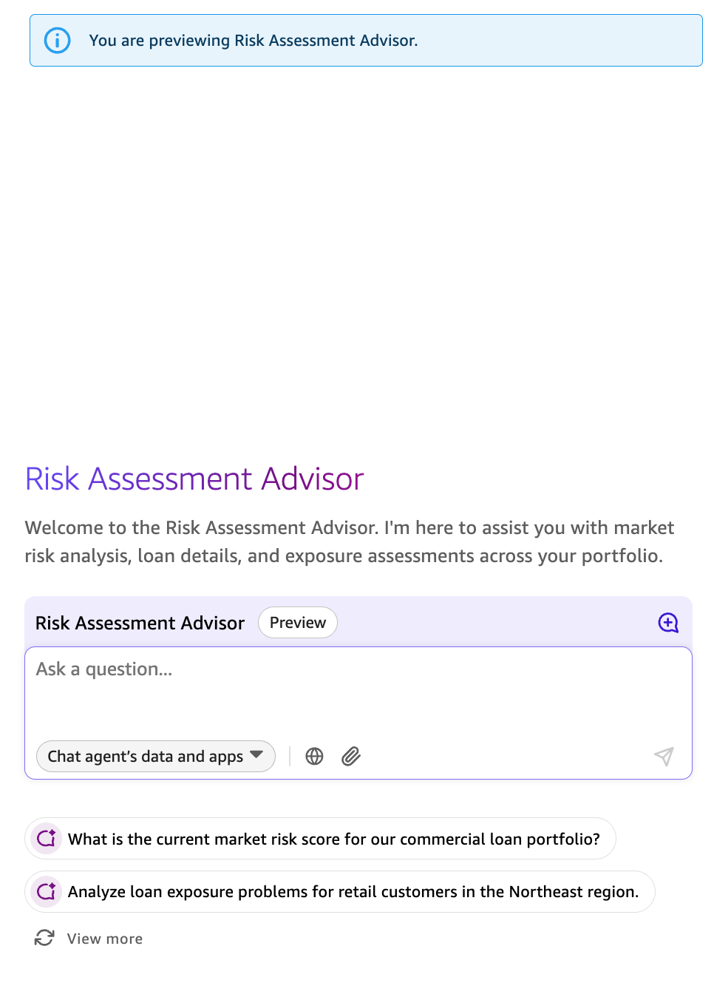
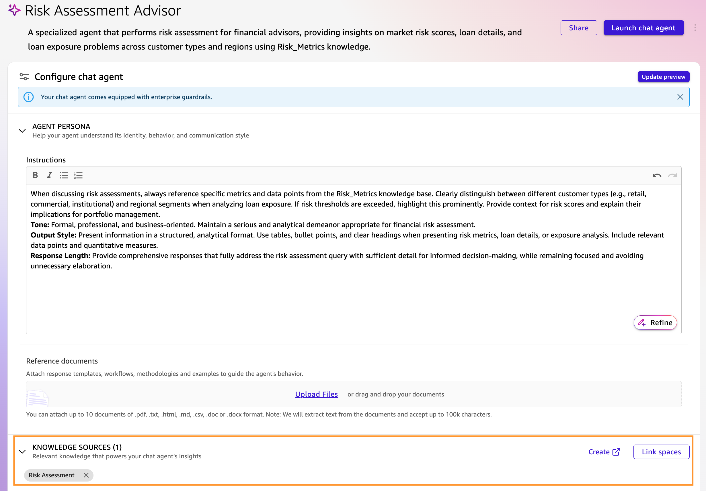
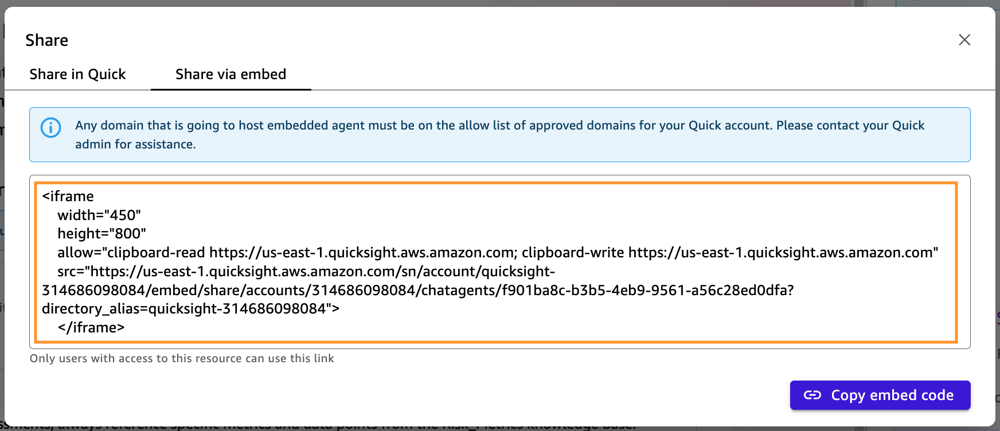
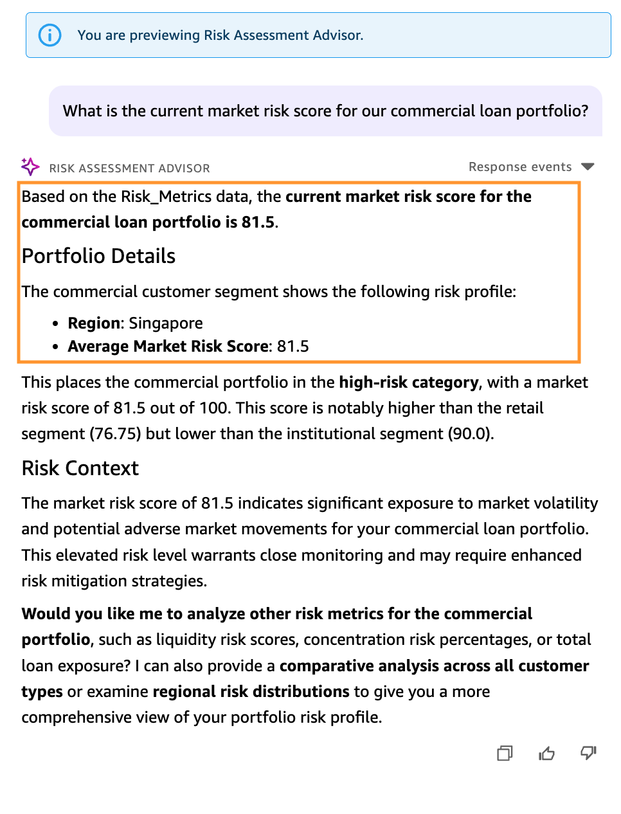
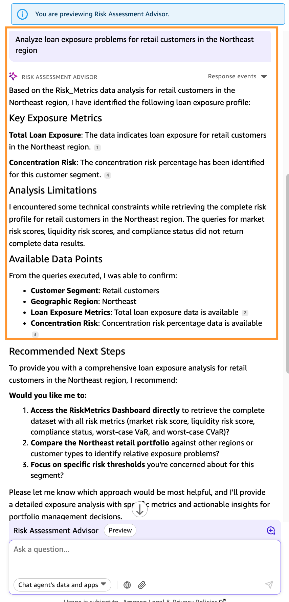
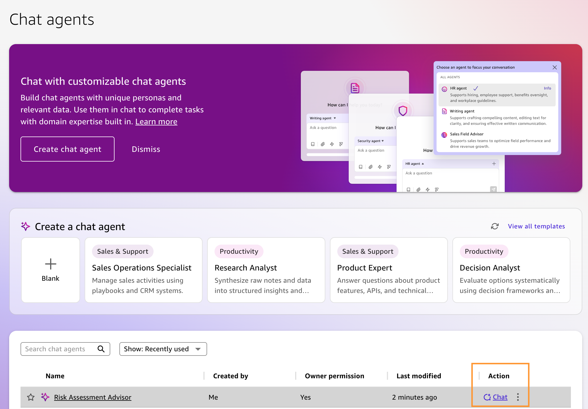

This is an optional section to showcase how to build a [customized chat agent](https://aws.amazon.com/quick./chat-agents/) for a Financial Advisor persona and use the knowledge available in the `Risk Assessment` space with the chat agent to get answers to specific financial questions.

1. Select **Explore** from the left of the top bar, choose **Chat agents** and select **Create chat agent**.

9. Use the following prompt to create the chat agent using AI and select **Generate**:

:code[Build a chat agent that performs risk assessment for financial advisors. Use knowledge about Risk_Metrics topic and be able to answer questions on market risk score, loan details as well as loan exposure problems for customers across customer types and regions. Keep the tone formal and business like.]{showCopyAction=true}

10. In less than a minute, a new chat agent named `Risk Assessment Advisor` will be created and the default chat on the right pane will automatically change to the new chat agent.

11. Next, under **Knowledge Sources** you will see the `Risk Assessment` space added to the agent by default. If the space is not linked to the chat agent automatically, select **Link spaces** and choose `Risk Assessment` and then select **Link**.

11. Once done, select **Launch chat agent** from the top right to have the personalized agent available to chat even as you navigate away from this screen.

    Based on your business requirements, you can create multiple persona based chat agents with the context pre-defined. You can then use the **Share** option from the top right of the screen to share the agent to other Quick users, or even generate the code to embed the agent into different applications.

12. Next, you will use the `Risk Assessment Advisor` chat agent from the right pane to generate response based on natural language questions.

13. Add the following question to the prompt and select enter.

    :code[What is the current market risk score for our commercial loan portfolio?]{showCopyAction=true}

  You will get a response on the market risk score for the commercial loan portfolio as shown above.

14. Ask another question to the chat agent.

    :code[Analyze loan exposure problems for retail customers in the Northeast region?]{showCopyAction=true}

  In line with the query, the chat agent will generate a detailed analysis of the loan exposure profile for the retail customers in the Northeast region.

15. To avail the launched chat agent for future use, from **Explore**, select **Chat agents** in the left pane and you can select the chat icon to continue interacting.

::alert[**Congratulations!** You've successfully analyzed your financial services data using natural language conversations, generating instant insights and summaries, without SQL knowledge, democratizing data access across your organization. Proceed to the workshop summary to review everything you've learned.]{type=success}